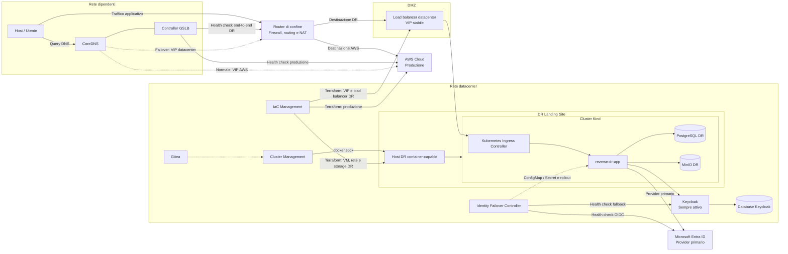

# Reverse Disaster Recovery Cloud-to-Ground

PoC containerizzata di Disaster Recovery DNS-based. AWS rappresenta il sito di produzione; alcuni host container-capable nella rete datacenter costituiscono il **DR Landing Site** sul quale viene creato un cluster Kind on demand. Il Docker host simula una postazione della rete dipendenti.

## Topologia



Il DR Landing Site non è una rete distinta: è una capacità di calcolo collocata nella rete datacenter. Nella PoC il nodo Kind viene quindi collegato a `rete-datacenter`.

## Responsabilità Terraform sul DR

Terraform è responsabile sia dell'infrastruttura AWS sia del substrato del DR Landing Site:

- VM o host container-capable;
- interfacce e segmenti della rete datacenter;
- dischi e storage persistente;
- regole firewall necessarie al piano dati e gestionale;
- VIP e load balancer datacenter;
- inventario e output consumati dal bootstrap del cluster.

Terraform non distribuisce i workload Kubernetes. Dopo il provisioning, `cluster-management` crea o configura Kind, Ansible applica i servizi DR e GitOps mantiene lo stato applicativo. Questa separazione evita di usare `local-exec` come sostituto di un orchestratore Kubernetes.

Nella PoC il Docker host esiste già, quindi Terraform non può creare la macchina fisica sottostante: può gestire il DR reale solo quando è disponibile il provider della piattaforma, ad esempio vSphere, Proxmox o OpenStack. Il codice Terraform AWS esistente resta eseguibile; l'adapter on-prem deve essere selezionato in base alla piattaforma effettiva, evitando risorse fittizie nel laboratorio.

## Responsabilità dei componenti di ingresso

Il percorso DR contiene due componenti L7 con responsabilità diverse:

1. `datacenter-load-balancer` è esterno al cluster e rappresenta una VIP stabile. In una soluzione reale sarebbe ridondato e potrebbe distribuire traffico fra più host o cluster DR.
2. Il Kubernetes Ingress Controller interpreta le risorse `Ingress` e instrada verso i `Service` interni al cluster.

Il `boundary-router` simula invece il router/firewall di confine. Nella PoC usa Nginx per rappresentare il NAT verso il load balancer, ma in produzione questo ruolo deve essere svolto da apparati L3/L4 o firewall HA.

## Reti Compose

| Rete | Responsabilità | Componenti principali |
|---|---|---|
| `rete-dipendenti` | LAN dalla quale parte l'accesso utente | Host simulato, DNS-GSLB e interfaccia interna del router |
| `rete-dmz` | Transito verso i servizi pubblicabili | Boundary router e load balancer datacenter |
| `rete-datacenter` | Backoffice, servizi permanenti e DR Landing Site | Gitea, Keycloak, controller identity, bastion, load balancer e nodi Kind |
| `rete-transito-cloud` | Transito controllato verso AWS/Internet | Router, DNS-GSLB, controller identity e bastion autorizzati |

Le reti aziendali sono `internal: true`. Le sole porte pubblicate sull'host sono `53/tcp`, `53/udp` per il DNS e `80/tcp` per il percorso applicativo DR. Gitea, Keycloak e i bastion non sono pubblicati direttamente.

## Keycloak permanente

Keycloak viene avviato con Docker Compose nella rete datacenter e utilizza un PostgreSQL persistente dedicato. Non viene creato né eliminato durante il failover. Il cluster registra Keycloak come dipendenza esterna mediante un `Service` e un `EndpointSlice`, mantenendo l'applicazione indipendente dall'indirizzo fisico.

L'indirizzo interno è configurato con:

```dotenv
DATACENTER_KEYCLOAK_IP=172.28.30.20
```

La `NetworkPolicy` Island Mode consente all'applicazione soltanto l'accesso ai servizi dati locali, al DNS Kubernetes e a questo endpoint Keycloak.

La PoC usa una singola istanza Keycloak in modalità sviluppo. In produzione servono almeno due istanze, TLS, cache distribuita, backup del database e una VIP interna stabile.

## Failover identity Entra ID → Keycloak

Microsoft Entra ID è il provider primario. `identity-failover-controller` controlla sia il documento OIDC di Entra sia la readiness del Keycloak datacenter e gestisce tre stati persistenti:

```text
entra_active
    ↓ Entra fallisce N volte e Keycloak è sano
keycloak_active
    ↓ Entra torna sano per N controlli
entra_recovered_awaiting_approval
    ↓ approvazione operatore
entra_active
```

Il failover verso Keycloak è automatico. Il failback verso Entra non è mai automatico: mentre attende l'approvazione l'applicazione continua a usare Keycloak.

Il controller aggiorna:

- `ConfigMap/identity-provider-active` con provider e issuer;
- `Secret/identity-provider-credentials` con client ID e client secret;
- l'annotazione del pod template per avviare un rollout controllato.

Stato e ultima transizione auditabile:

```bash
docker compose exec identity-failover-controller \
  cat /var/lib/identity/status.json
```

Il comando di approvazione è accettato solo nello stato `entra_recovered_awaiting_approval` e richiede l'identità dell'operatore:

```bash
docker compose exec cluster-management \
  bash scripts/04_approve_entra_failback.sh nome.operatore
```

L'approvazione scade dopo `IDENTITY_APPROVAL_TTL_SECONDS`; operatore, timestamp e transizione restano nello stato del controller. Le credenziali non vengono scritte nei log.

La `NetworkPolicy` standard non supporta allowlist FQDN. La PoC consente HTTPS pubblico per raggiungere Entra; in produzione questo traffico deve attraversare un egress gateway con allowlist per gli endpoint Microsoft.

## DNS-GSLB

Il controller controlla produzione e DR separatamente. Il passaggio a DR avviene solo quando:

1. la produzione fallisce per `GSLB_FAILURE_THRESHOLD` controlli consecutivi;
2. `/ready` del DR risponde correttamente per `GSLB_RECOVERY_THRESHOLD` controlli consecutivi.

`/ready` verifica realmente PostgreSQL, MinIO e Keycloak; il GSLB non considera quindi sano un sito che espone soltanto Nginx.

Il record DNS usa TTL breve e viene aggiornato atomicamente. Lo stato è consultabile con:

```bash
docker compose exec cluster-management cat /var/lib/gslb-control/status.json
```

Override operativo:

```bash
docker compose exec cluster-management bash scripts/03_set_gslb_mode.sh auto
docker compose exec cluster-management bash scripts/03_set_gslb_mode.sh production
docker compose exec cluster-management bash scripts/03_set_gslb_mode.sh dr
```

Gli override `production` e `dr` bypassano volontariamente gli health check. `auto` restituisce la decisione alla policy.

## Configurazione

1. Copiare `.env.example` in `.env`.
2. Sostituire tutte le credenziali di esempio.
3. Configurare:

   - `PRODUCTION_APP_IP`: VIP/IP stabile del frontend AWS;
   - `PRODUCTION_HEALTH_URL`: readiness della produzione;
   - `DR_INGRESS_IP`: VIP del router/load balancer DR raggiungibile dai dipendenti;
   - `DR_HEALTH_URL`: URL che attraversa l'intera catena DR;
   - `DATACENTER_KEYCLOAK_IP`: indirizzo stabile interno di Keycloak;
   - endpoint, client ID e secret Entra/Keycloak indicati in `.env.example`;
   - soglie e durata dell'approvazione identity.

`127.0.0.1` è accettabile come `DR_INGRESS_IP` soltanto nella PoC single-host. In un datacenter reale deve essere una VIP instradabile.

## Avvio

```bash
docker compose up -d --build
docker compose exec cluster-management bash scripts/01_init_corporate_git.sh
docker compose exec cluster-management bash scripts/00_bootstrap_cluster.sh
```

Provisioning Terraform della produzione AWS:

```bash
docker compose exec iac-management bash
cd codice_iac/terraform
cp terraform.tfvars.example terraform.tfvars
export TF_VAR_database_password='una-password-di-almeno-16-caratteri'
terraform init
terraform plan -out=production.tfplan
terraform apply production.tfplan
```

In un datacenter reale si esegue poi il piano Terraform del modulo DR specifico della piattaforma. I suoi output — indirizzi degli host, rete, storage e VIP — diventano input di Ansible e del bootstrap Kind. Nel laboratorio single-host tali risorse sono già fornite da Docker Desktop e Docker Compose.

Attivazione dei workload DR:

```bash
docker compose exec cluster-management bash scripts/02_trigger_failover.sh
```

Lo script distribuisce applicazione, PostgreSQL e MinIO. Keycloak rimane attivo indipendentemente dallo stato del cluster. Il GSLB commuta solo dopo il superamento degli health check.

## Verifica

```bash
nslookup app.reverse-dr.local 127.0.0.1
curl --header 'Host: app.reverse-dr.local' http://127.0.0.1/ready
```

Se la porta 53 è già occupata da un resolver Windows, eseguire la query da un client collegato a `rete-dipendenti` usando il DNS `172.28.10.53` oppure liberare la porta.

## Miglioramenti necessari per la produzione

- almeno due host DR e un load balancer/VIP ridondato;
- replica continua e verificata di PostgreSQL e object storage, con RPO/RTO misurati;
- Keycloak HA con database replicato, TLS e backup testati;
- TLS end-to-end e gestione centralizzata dei certificati;
- health check da più punti di osservazione per evitare decisioni basate su un guasto locale;
- audit degli override GSLB e alert su cambio sito;
- eliminazione del Docker socket diretto dal bastion o isolamento su host dedicato;
- prereplica offline di immagini, manifest e chart necessari al DR.

La PoC implementa i confini e i punti di estensione per questi requisiti, ma non simula replica geografica o alta affidabilità su un singolo Docker host.
