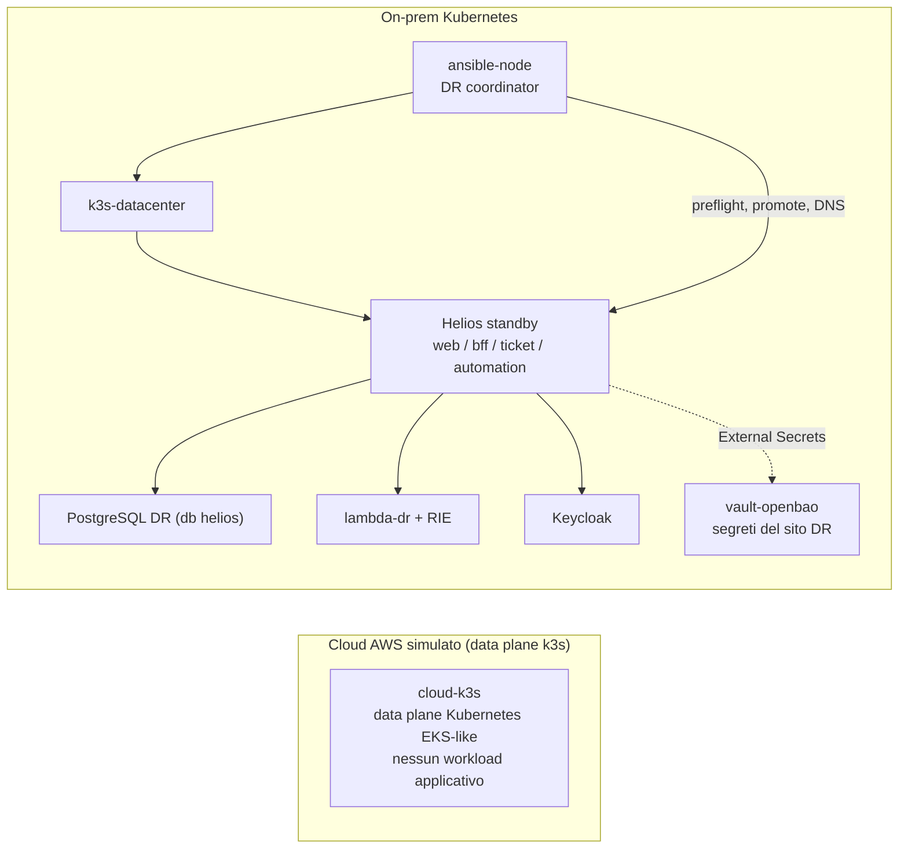

# Runbook Reverse DR production-like

## Obiettivo

La PoC separa i failure domain e mantiene lo stesso contratto applicativo nei due siti:



Questo runbook porta la PoC **da un PC nuovo a un sito DR completo in standby**, e
poi al drill di failover. È lungo di proposito: ogni passo che negli script non
esiste ancora è esplicitato come comando.

L'unica applicazione è Helios
(`automazione/apps`, `automazione/infra/onprem`); il sito primario reale è AWS
EKS (`automazione/infra/aws`). `cloud-k3s` resta solo come dominio di guasto che
il drill spegne.

**Segreti: stesso contratto, provider diverso per sito.** Sul primario AWS
Secrets Manager, sul DR OpenBao sul nodo `vault-openbao`; su entrambi i Secret
Kubernetes sono materializzati da External Secrets Operator (ESO) con gli stessi
nomi. Vedi [`infra/vault/README.md`](infra/vault/README.md).

---

## 0. Prerequisiti sull'host

Host: Windows con **WSL2 (Ubuntu)**. Dentro la Ubuntu WSL servono:

- **LXD** inizializzato e utente nel gruppo `lxd`;
- **Docker** (build delle immagini applicative);
- **kubectl**, **helm**, **openssl**, **python3**, **git**.

```bash
sudo snap install lxd && sudo lxd init --minimal
sudo usermod -aG lxd "$USER"   # poi: wsl --shutdown da PowerShell e riapri
```

```bash
command -v docker kubectl helm openssl python3 git
```

Dopo ogni `wsl --shutdown` o `snap restart lxd`, attendi che LXD sia pronto
**prima** di lanciare comandi `lxc`, altrimenti ricevi un `Forbidden` transitorio:

```bash
sudo lxd waitready --timeout=60 && lxc list >/dev/null && echo "LXD pronto"
```

Tutti i comandi seguenti partono dalla root del repository, salvo dove indicato.

---

## 1. Rete e nodi del laboratorio

```bash
sudo iptables -P FORWARD ACCEPT
sudo iptables -I FORWARD -i lxdbr0 -j ACCEPT
sudo iptables -I FORWARD -o lxdbr0 -j ACCEPT
```

Senza queste regole il traffico fra i segmenti LXD non passa e il setup fallisce.

```bash
cd automazione/lxc-lab
bash setup.sh
bash healthcheck.sh
cd ../..
```

Crea router, DNS (`server-dns` 10.10.2.53), `git-server`, `ansible-node`,
`k3s-datacenter` (10.10.3.10), `vault-openbao` (10.10.3.80) e i segmenti isolati.
`ansible-node` e `vault-openbao` hanno `boot.autostart=true`: ripartono da soli
dopo un riavvio di LXD/WSL.

### 1a. MTU dei container (OBBLIGATORIO su WSL2)

Su WSL2 il percorso di rete annidato (WSL → LXD → container) ha una MTU effettiva
inferiore a 1500. Con la MTU di default i pacchetti TLS grandi vengono persi e
**ogni pull di immagini da internet fallisce** con `net/http: TLS handshake
timeout`. Il guasto è insidioso perché si manifesta in punti diversi:

- pod bloccati in `ContainerCreating` / `ImagePullBackOff` (`pause`, ESO,
  postgres, keycloak);
- PVC `Pending` perché l'helper pod del provisioner `local-path` (una `busybox`)
  non riesce a scaricare la propria immagine → il volume non nasce.

`lxc network set <rete> bridge.mtu 1200` **NON funziona** su WSL2: LXD prova a
scrivere sysctl IPv6 (`/proc/sys/net/ipv6/conf/...`) che nel kernel WSL non
esistono. Si imposta quindi la MTU **per-interfaccia** su ogni container e si
riavvia (valore 1200 testato in questo ambiente):

```bash
for c in $(lxc list -c n --format csv); do
  lxc config device override "$c" eth0 mtu=1200 2>/dev/null \
    || lxc config device set "$c" eth0 mtu=1200 2>/dev/null || true
done
lxc restart --all
```

Verifica che un nodo che scarica immagini sia a `mtu 1200` (sblocco immediato
runtime, senza riavvio, se serve al volo: `lxc exec <nodo> -- ip link set eth0 mtu 1200`):

```bash
lxc exec k3s-datacenter -- ip -o link show eth0 | grep -o 'mtu [0-9]*'
```

Salta questo passo e i passi 6, 10 e 11 falliranno con timeout apparentemente
scollegati fra loro: è **sempre** la MTU.

## 2. Cluster k3s

```bash
cd automazione/helpdesk-dr
bash scripts/poc/setup-cloud-sim.sh
bash scripts/poc/setup-onprem-k3s.sh
cd ../..
```

`cloud-k3s` è il dominio di guasto del drill; `k3s-datacenter` ospita Helios.

## 3. kubeconfig verso il cluster on-prem

Diversi passi seguenti (ESO, ExternalSecret, migrazioni, provisioning operatore)
usano `kubectl`/`helm` **dall'host**. Serve un kubeconfig che punti all'API di
`k3s-datacenter`:

```bash
mkdir -p ~/.kube
lxc exec k3s-datacenter -- cat /etc/rancher/k3s/k3s.yaml \
  | sed 's#127.0.0.1#10.10.3.10#' > ~/.kube/helios-onprem.yaml
export KUBECONFIG=~/.kube/helios-onprem.yaml
kubectl get nodes
```

Se `kubectl get nodes` desse un errore TLS sul nome del server, il certificato
dell'API k3s non include `10.10.3.10`: rigenera k3s con `--tls-san 10.10.3.10`
oppure lavora via `lxc exec k3s-datacenter -- k3s kubectl`. Con la topologia di
default l'IP del nodo è nel SAN e il comando funziona.

## 4. Certificati TLS

Un solo certificato self-signed che copre i tre hostname del sito DR
(`helpdesk`, `auth`, `vault`) e fa da CA per ESO. In produzione qui va una CA
reale.

Il SAN include anche `IP:127.0.0.1` e `DNS:localhost`: i comandi OpenBao locali
(init/unseal, e l'auto-unseal via systemd) si connettono a `https://127.0.0.1:8200`,
quindi senza l'IP nel SAN la verifica TLS fallirebbe. `IP:10.10.3.80` copre
un'eventuale connessione diretta per IP al nodo.

```bash
openssl req -x509 -newkey rsa:4096 -sha256 -days 825 -nodes \
  -keyout ~/azienda-lan.key -out ~/azienda-lan.crt \
  -subj "/CN=azienda.lan" \
  -addext "subjectAltName=DNS:heliospoc.terna.it,DNS:auth.azienda.lan,DNS:vault.azienda.lan,DNS:localhost,IP:127.0.0.1,IP:10.10.3.80"
```

## 5. Immagini applicative Helios

I Deployment on-prem usano immagini `:local` con `imagePullPolicy: IfNotPresent`;
nessun registry le serve. Lo script le builda dall'host e le importa nel
containerd di `k3s-datacenter` (equivalente on-prem del push in ECR):

```bash
bash automazione/apps/scripts/build-helios-images.sh
```

L'import deve elencare quattro immagini: `helios-bff`, `helios-ticket-service`,
`helios-automation-service`, `reverse-dr/helios-desk-frontend`.

## 6. External Secrets Operator

ESO è il consumatore dei segreti su entrambi i siti. Installalo nel cluster
on-prem (riusa il values del lato AWS, che abilita le CRD).

**Prima verifica il contesto**: `helm`/`kubectl` devono puntare al k3s on-prem
(passo 3), non a un `docker-desktop`/minikube locale — altrimenti ESO finisce nel
cluster sbagliato e il resto del DR non lo vede:

```bash
kubectl config current-context   # NON deve essere "docker-desktop"
kubectl get nodes                # deve elencare k3s-datacenter
```

Poi installa con `upgrade --install` (idempotente: non dà "cannot re-use a name"
se rilanci) e un timeout ampio, perché il primo pull delle immagini ESO in LXC è
lento:

```bash
helm repo add external-secrets https://charts.external-secrets.io
helm repo update
helm upgrade --install external-secrets external-secrets/external-secrets \
  -n external-secrets --create-namespace \
  -f automazione/infra/aws/kubernetes/external-secrets-values.yaml.example \
  --wait --timeout 15m
```

Se `--wait` scade comunque, non reinstallare: i pod stanno solo ancora salendo.
Controlla e attendi `Running`:

```bash
kubectl -n external-secrets get pods
```

Se restano in `ContainerCreating`/`ImagePullBackOff` → hai saltato il passo 1a
(MTU). Se una release precedente è rimasta in stato `failed`/`pending`, ripulisci
con `helm uninstall external-secrets -n external-secrets` e rilancia l'`upgrade`.

## 7. Namespace e identità dei consumatori (prima di OpenBao)

Questo passo rompe una dipendenza circolare: `configure-openbao.sh` (passo 8) ha
bisogno del ServiceAccount `openbao-token-reviewer`, che nasce da questi manifest;
ma `deploy-onprem-standby.sh` (passo 11) pretende OpenBao già funzionante. Si
applicano quindi prima **solo** namespace e manifest ESO:

```bash
kubectl apply -f automazione/infra/onprem/namespaces.yaml
kubectl apply -f automazione/infra/onprem/secrets/external-secrets.yaml
```

Gli `ExternalSecret` risulteranno in errore finché OpenBao non è popolato: è
atteso, si risolvono al passo 9.

## 8. OpenBao: installazione, sigillo, configurazione

```bash
export OPENBAO_VERSION=2.6.1   # senza 'v'; lo script scarica openbao_<versione>_linux_amd64.tar.gz
export OPENBAO_TLS_CERT_FILE=~/azienda-lan.crt OPENBAO_TLS_KEY_FILE=~/azienda-lan.key
bash automazione/infra/vault/scripts/install-openbao.sh
```

Inizializza **una sola volta** (produce chiavi Shamir e root token: non è in uno
script di proposito):

```bash
lxc exec vault-openbao -- env BAO_ADDR=https://127.0.0.1:8200 \
  BAO_CACERT=/etc/openbao/tls/tls.crt bao operator init
```

Conserva chiavi e root token **fuori dal repository e fuori dal lab**, poi
dissigilla (tre chiavi diverse):

```bash
lxc exec vault-openbao -- env BAO_ADDR=https://127.0.0.1:8200 \
  BAO_CACERT=/etc/openbao/tls/tls.crt bao operator unseal   # ripeti 3 volte
```

Configura mount KV, policy e autenticazione Kubernetes:

```bash
export BAO_TOKEN=s.TV5ykQSOPvVZXHsbOTerVhsb
export OPENBAO_CA_FILE=~/azienda-lan.crt
bash automazione/infra/vault/scripts/configure-openbao.sh
```

## 9. Segreti in OpenBao

`seed-secrets.sh` gira sull'host e parla a `https://vault.azienda.lan:8200`, ma
l'host non usa il DNS del lab. Aggiungi la risoluzione e la CA:

```bash
echo "10.10.3.80 vault.azienda.lan" | sudo tee -a /etc/hosts
export BAO_CACERT=~/azienda-lan.crt
ping -c1 10.10.3.80   # l'host deve raggiungere il nodo vault
```

Esporta i valori dei segreti (nella stessa shell) e scrivili in OpenBao. Genera
la chiave Fernet una volta:

```bash
# Chiave Fernet = 32 byte in base64 url-safe. La genera la stdlib di python3
# (nessun venv, nessuna libreria esterna): il .venv del backend e' un venv
# Windows e non e' eseguibile in WSL.
# --- Segreti casuali (URL-safe: nessun quoting/encoding necessario) ---
export HELIOS_SESSION_ENCRYPTION_KEY="$(python3 -c 'import base64,os; print(base64.urlsafe_b64encode(os.urandom(32)).decode())')"
export KEYCLOAK_DB_PASSWORD="$(python3 -c 'import secrets; print(secrets.token_urlsafe(18))')"
export KEYCLOAK_ADMIN_PASSWORD="$(python3 -c 'import secrets; print(secrets.token_urlsafe(18))')"
export HELIOS_BFF_CLIENT_SECRET="$(python3 -c 'import secrets; print(secrets.token_urlsafe(32))')"
export HELIOS_DR_OPERATOR_PASSWORD="$(python3 -c 'import secrets; print(secrets.token_urlsafe(18))')"

# --- Valori fissi ---
export KEYCLOAK_ADMIN_USERNAME='admin-bootstrap'
export HELIOS_DR_OPERATOR_USERNAME='luca.catalano'
export HELIOS_DR_OPERATOR_EMPLOYEE_ID='demo-employee'
export HELIOS_DR_OPERATOR_EMAIL='luca.catalano@terna.it'

# --- TLS ---
export HELIOS_TLS_CERT_FILE=~/azienda-lan.crt HELIOS_TLS_KEY_FILE=~/azienda-lan.key

# --- DATABASE_URL: password del postgres del lab, letta e URL-encoded ---
POSTGRES_PWD="$(set -a; . automazione/helpdesk-dr/config.env; printf '%s' "$POSTGRES_PASSWORD")"
export HELIOS_DATABASE_URL="postgresql+asyncpg://helpdesk:$(python3 -c 'import urllib.parse,sys; print(urllib.parse.quote(sys.argv[1], safe=""))' "$POSTGRES_PWD")@postgres.helpdesk.svc.cluster.local:5432/helios"
```

`HELIOS_DATABASE_URL` **deve** finire con `/helios`, non `/helpdesk`: lo script
rifiuta il database legacy. La password è quella del PostgreSQL del lab
(`helpdesk-dr/config.env`, `POSTGRES_PASSWORD`) — **sostituisci il placeholder
`replace-with-a-random-lab-password`** con un valore reale in `config.env` prima
del deploy, altrimenti il postgres del lab userà quella stringa come password.

Lo schema dell'URL può essere `postgresql://` o `postgresql+asyncpg://`: i
servizi normalizzano il prefisso in stile SQLAlchemy prima di passarlo a psycopg
(vedi `helios_shared/db.py`), quindi entrambi funzionano.

```bash
bash automazione/infra/vault/scripts/seed-secrets.sh
```

Auto-unseal (opt-in esplicito: hai scelto di attivarlo). Colloca le chiavi sul
nodo — compromesso dichiarato in `infra/vault/README.md`:

```bash
export OPENBAO_UNSEAL_KEYS="m+AzwyRjz77W4dkY7qkw+bvPuENwZsDffeLMj8yCDgaA pa2idEXcjVzcXH3SD0vSbrz/M09h7OJrZE/mdMgMjywL rPYnEY2qDUtFF/8TFicMK6hx1HcS8pBgz02tekt6OszI"
export OPENBAO_ACCEPT_AUTO_UNSEAL_RISK=yes
bash automazione/infra/vault/scripts/enable-auto-unseal.sh
```

Verifica che ESO abbia materializzato gli otto Secret:

```bash
kubectl get externalsecrets -A
kubectl get secret -n helios-desk helios-app-database helios-bff-runtime helios-app-tls
```

Tutti gli `ExternalSecret` devono passare a `SecretSynced`. Se restano in errore,
il problema è di rete/DNS fra ESO e OpenBao (vedi passo "risoluzione problemi").

## 10. Runtime lambda-dr e standby on-prem

```bash
cd automazione/helpdesk-dr
bash scripts/deploy/deploy-lambda-onprem.sh
bash scripts/deploy/deploy-onprem-standby.sh
cd ../..
```

`deploy-onprem-standby.sh` verifica OpenBao dissigillato e le CRD di ESO, applica
gli overlay Helios + PostgreSQL, lascia Keycloak warm e forza i quattro workload
applicativi a `replicas: 0`. Lo standby usa `AUTOMATION_MODE=lambda-dr`.

## 11. Database applicativo e schema

Il PostgreSQL del lab (namespace `helpdesk`) è ora attivo. Crea il database
**dedicato** `helios` e applica lo schema:

```bash
export KUBECONFIG=~/.kube/helios-onprem.yaml
kubectl -n helpdesk exec deploy/postgres -- sh -c \
  "psql -U helpdesk -tc \"SELECT 1 FROM pg_database WHERE datname='helios'\" | grep -q 1 \
   || psql -U helpdesk -c 'CREATE DATABASE helios OWNER helpdesk'"
```

Il `CREATE` è condizionale: su un DB `helios` già esistente (per esempio dopo un
drill precedente) `CREATE DATABASE` darebbe `already exists` e, in una catena
`&&`, interromperebbe i passi successivi.

> **Se hai fatto `kubectl delete namespace helios-desk`** (reset pulito): quel
> namespace contiene il ServiceAccount `openbao-token-reviewer`, il cui token JWT
> è memorizzato in OpenBao per la TokenReview. Ricrearlo invalida quel token e i
> `SecretStore` vanno in `InvalidProviderConfig`, quindi nessun Secret viene
> materializzato. Riesegui `configure-openbao.sh` (rigenera il token-reviewer)
> **prima** di questo passo:
>
> ```bash
> export BAO_TOKEN=<root token>; export OPENBAO_CA_FILE=~/azienda-lan.crt
> bash automazione/infra/vault/scripts/configure-openbao.sh
> ```

Prerequisito: **Keycloak deve essere `Ready`** (il provisioning ci si connette).
Il wrapper lo verifica da solo, ma controlla prima per non aspettare a vuoto:

```bash
kubectl -n helios-identity get pods -l app.kubernetes.io/name=keycloak
```

```bash
cd automazione/infra/onprem
bash scripts/apply-migrations.sh
bash scripts/provision-dr-operator.sh
cd ../..
```

`apply-migrations.sh` applica anche `002_dr_telemetry.sql`, la tabella da cui la
dashboard legge RPO/RTO.

> **ATTENZIONE — usa il wrapper giusto.** Lo script da lanciare dall'host è
> `infra/onprem/scripts/provision-dr-operator.sh`: crea in cluster il Job
> `helios-dr-operator-provisioner` (immagine Keycloak, con `kcadm` e i Secret
> montati), assegna all'operatore i ruoli `tickets.read/write` e
> `automation.execute`, e **fallisce con errore** se il Job non completa. NON
> lanciare `infra/onprem/keycloak/provision/provision-dr-operator.sh`: è la copia
> *interna* eseguita dentro il pod (usa `/opt/keycloak/bin/kcadm.sh`) e sull'host
> dà `kcadm.sh: No such file or directory`.

**Verifica anti-403 (fallo ora, non dopo il login).** Il 403 dopo il login
significa sempre che il token dell'operatore non porta i ruoli. Due controlli:

1. Il Job di provisioning è completato con successo?
   ```bash
   kubectl -n helios-identity get job helios-dr-operator-provisioner
   ```
   Deve risultare `COMPLETIONS 1/1`. Se manca o è fallito, il wrapper non è
   andato: rilancialo (è idempotente).

2. Dopo la promozione, al **primo login** il token deve arrivare con i ruoli. Il
   BFF cachea il token in sessione, quindi il login **deve essere pulito**:
   finestra **in incognito** (o cancella i cookie `__Host-helios_session` e
   `__Host-helios_csrf`). Verifica che la sessione più recente porti i ruoli:
   ```bash
   kubectl -n helpdesk exec deploy/postgres -- psql -U helpdesk -d helios \
     -c "SELECT principal->'permissions' AS perms, expires_at FROM bff_sessions ORDER BY expires_at DESC LIMIT 1;"
   ```
   Deve mostrare `["automation.execute","tickets.read","tickets.write"]`. Se è
   `[]` indica che il token è stato emesso prima della riconciliazione oppure
   che il Job non ha usato il provisioner corrente. Rilancia
   `bash scripts/provision-dr-operator.sh`: il wrapper aggiorna il ConfigMap e
   riconcilia in modo idempotente default scope, mapper e scope-mapping
   `helios-bff -> helios-api`, quindi verifica sia l'ID token sia l'access token
   prima di completare. Dopo il successo esegui logout/login (o usa una finestra
   in incognito), perché il BFF conserva i claim nella sessione già aperta.

## 12. Coordinatore DR

Prima del bootstrap configura il target reale in
`automazione/helpdesk-dr/config.env`. Un ALB non ha un IP statico: usa il suo
DNS name e arma il controller solo dopo aver verificato il valore:

```bash
alb_dns="$(kubectl -n helios-desk get ingress helios-public \
  -o jsonpath='{.status.loadBalancer.ingress[0].hostname}')"
test -n "$alb_dns"
printf 'CLOUD_PROBE_MODE=https\nCLOUD_TARGET_HOST=%s\nCLOUD_DNS_TARGET=%s\nDR_AUTO_FAILOVER_ENABLED=true\n' "$alb_dns" "$alb_dns"
```

I valori stampati vanno aggiunti al file, non usati per sostituirne il
contenuto. Il bootstrap valida interlock, stato, timeout e target prima di
avviare il servizio; una configurazione incompleta interrompe il bootstrap
invece di essere interpretata come outage.

`CLOUD_TARGET_HOST` e `CLOUD_DNS_TARGET` devono contenere entrambi il **DNS
name dell'ALB**, mai un suo IP: il primo e' il target del probe indipendente,
il secondo fa pubblicare a Bind un CNAME tramite una Response Policy Zone (RPZ)
applicata esclusivamente a `heliospoc.terna.it`; Bind non diventa autorevole
per `terna.it`, quindi i domini aziendali di autenticazione restano risolvibili. Con
`sudo bash automazione/lxc-lab/host-dns.sh enable`, anche le applicazioni
eseguite sul WSL host interrogano `server-dns`: dopo il failover il controller
pubblica un record `A` verso k3s on-prem; dopo il cutback manuale ripristina il
CNAME verso AWS. Il TTL e' 30 secondi; usa `resolvectl flush-caches` se devi
osservare subito il cambio.

Se non hai un ACM **validato pubblicamente**, la via preferita e' un self-signed
importato in ACM: l'edge resta HTTPS (login `__Host-*` intatto) e il probe punta
all'IP dell'ALB rilassando la verifica del cert non attendibile (vedi
`helpdesk-dr/README.md`, "Senza ACM pubblico: self-signed HTTPS"):

```bash
alb_ip="<IP o DNS name dell'ALB>"
printf 'CLOUD_PROBE_MODE=https\nCLOUD_TARGET_HOST=%s\nCLOUD_TARGET_INSECURE=true\nDR_AUTO_FAILOVER_ENABLED=true\n' "$alb_ip"
```

Solo se non puoi caricare **nessun** cert sull'ALB, come ultima spiaggia usa il
probe HTTP puro (rompe il login utente, ALB su HTTP senza `ssl-redirect`):

```bash
alb_ip="<IP pubblico dell'ALB>"
printf 'CLOUD_PROBE_MODE=http\nCLOUD_TARGET_HOST=%s\nCLOUD_TARGET_PORT=80\nDR_AUTO_FAILOVER_ENABLED=true\n' "$alb_ip"
```

```bash
cd automazione/helpdesk-dr
bash scripts/poc/publish-git-truth.sh
bash scripts/poc/bootstrap-ansible-control-node.sh
bash scripts/poc/ansible-run.sh poc/healthcheck
cd ../..
```

`healthcheck.sh` verifica anche che OpenBao sia dissigillato e il runtime
lambda-dr sia pronto. A questo punto il sito DR è **completo in standby**: tutto
installato, workload applicativi a zero fino alla promozione.

Il bootstrap installa inoltre `helpdesk-dr-controller.service` su
`ansible-node`, lo abilita al boot e lo avvia immediatamente. Verifica:

```bash
lxc exec ansible-node -- systemctl status helpdesk-dr-controller.service --no-pager
lxc exec ansible-node -- journalctl -u helpdesk-dr-controller.service -n 50 --no-pager
```

In modalita' `https` il probe connette direttamente all'ALB mantenendo
`heliospoc.terna.it` come Host e TLS SNI, e gli IP *risolti* dall'ALB non vanno
mai salvati. In modalita' `http` (senza ACM) l'IP dell'ALB e' invece impostato
di proposito in `CLOUD_TARGET_HOST` e va aggiornato quando cambia.

---

## Verifica: vedere l'applicazione

In modalità normale il DNS punta `heliospoc.terna.it` al sito primario (AWS,
fuori dal lab): in laboratorio non c'è quindi un'app da interrogare a riposo. Il
modo per **vedere Helios in funzione nel lab è promuoverlo** con il drill: la
promozione scala i workload da zero, sposta il DNS e rende il sito DR attivo.

## Disaster recovery drill

Il playbook di failover porta il sito DR ad avere **compute in esecuzione e
storage allineato**: prima di toccare il DNS esegue il restore del database
`helios` (compute fermo, dati ripristinati), preflight lambda-dr, preflight
OpenBao, promozione dei workload con switch del BFF su Keycloak, canary di
readiness, e infine registra l'RTO misurato.

Il restore ha bisogno di un backup nel mirror on-prem, in **formato custom
`.dump`** (lo stesso prodotto dal CronJob del primario e consumato da
`pg_restore`). Nel lab non esiste un primario che lo produce (vedi "Limiti"):
crea un backup stand-in del database `helios` e mettilo nel mirror. Il file
`.sha256` deve contenere il **basename**, perché `restore-onprem.sh` verifica il
checksum dopo aver copiato l'archivio in una directory temporanea:

```bash
ts="$(date -u +%Y%m%dT%H%M%SZ)"
lxc exec k3s-datacenter -- kubectl -n helpdesk exec deploy/postgres -- pg_dump -U helpdesk -Fc helios > "/tmp/${ts}.dump"
( cd /tmp && sha256sum "${ts}.dump" > "${ts}.dump.sha256" )
lxc exec ansible-node -- install -d /srv/helpdesk-dr-mirror/postgres
lxc file push "/tmp/${ts}.dump" "ansible-node/srv/helpdesk-dr-mirror/postgres/${ts}.dump"
lxc file push "/tmp/${ts}.dump.sha256" "ansible-node/srv/helpdesk-dr-mirror/postgres/${ts}.dump.sha256"
```

Poi provoca il guasto ed esegui il failover:

```bash
cd automazione/helpdesk-dr
lxc stop cloud-k3s --force
bash scripts/poc/ansible-run.sh failover/dr-controller oneshot
cd ../..
```

## Verifica dopo il DR

```bash
cd automazione/helpdesk-dr && bash scripts/poc/ansible-run.sh poc/healthcheck && cd ../..
```

Dal client interno `pc-dipendente1` (che usa il DNS del lab), autenticati su
Keycloak e verifica:

1. `GET /api/v1/session` riporta `site.mode = dr` e `site.identityProvider = keycloak`;
2. esegui l'automazione di un ticket dalla dashboard: l'esecutore mostrato passa
   da `aws-lambda` a **`lambda-dr`**, runtime `lambda-rie-onprem` — stessa
   function, runtime diverso;
3. la colonna operativa mostra l'**RTO appena misurato** dal playbook.

L'endpoint `/dr-status` del monolite non esiste più: il sito attivo si legge da
`/api/v1/session`.

### Aprire la dashboard nel browser dell'host

L'host Windows non è nel lab e non usa `server-dns`, quindi `heliospoc.terna.it`
non risolve e gli IP `10.10.3.x` (dentro WSL2+LXD) non sono raggiungibili dal
browser. La dashboard usa cookie `__Host-*` e callback OIDC legati a
`https://heliospoc.terna.it`, quindi non si può usare `localhost` o un IP nudo:
serve proprio quell'hostname sulla porta 443. Si instrada verso l'ingress Traefik
con un port-forward.

Non si usa `--address 127.0.0.1` + `localhost` nel file hosts: il
`localhostForwarding` di WSL2 sulla 443 privilegiata non è affidabile (il
port-forward risponde `200` da dentro WSL ma il browser Windows non riceve nulla).
Il metodo robusto è esporre il port-forward su **tutte le interfacce WSL**
(`--address 0.0.0.0`) e puntare il file hosts di Windows all'**IP eth0 di WSL**,
che Windows raggiunge direttamente.

Prerequisito: i workload Helios devono essere **promossi** (drill completato),
altrimenti l'ingress risponde 503.

1. In WSL, ricava l'IP eth0 della VM WSL (è quello che Windows può raggiungere;
   il primo token di `hostname -I`):

   ```bash
   ip -4 -o addr show eth0 | awk '{print $4}' | cut -d/ -f1
   ```

   In alternativa, più corto: `hostname -I | awk '{print $1}'`. Annota il valore
   (es. `172.23.112.78`); **cambia a ogni `wsl --shutdown`/riavvio**, quindi va
   riletto e riaggiornato nel file hosts ogni volta.

2. Port-forward dell'ingress su tutte le interfacce, in una shell dedicata da
   tenere aperta. `sudo` perché la 443 è privilegiata, e `env KUBECONFIG=...`
   perché `sudo` azzera l'ambiente dell'utente:

   ```bash
   sudo env KUBECONFIG="$HOME/.kube/helios-onprem.yaml" \
     kubectl -n kube-system port-forward svc/traefik 443:443 --address 0.0.0.0
   ```

3. Nel file hosts di Windows (`C:\Windows\System32\drivers\etc\hosts`), con l'IP
   letto al passo 1. Per generare la riga esatta da incollare, da WSL:

   ```bash
   echo "$(hostname -I | awk '{print $1}') heliospoc.terna.it auth.azienda.lan"
   ```

   Puoi aggiornarlo in modo idempotente da un **PowerShell come amministratore**
   (rimuove le vecchie righe per quei due host e riscrive quella corrente con
   l'IP di WSL):

   ```powershell
   $wslIp = (wsl -e bash -lc "hostname -I | awk '{print `$1}'").Trim()
   $hosts = "$env:windir\System32\drivers\etc\hosts"
   $keep  = Get-Content $hosts | Where-Object { $_ -notmatch 'heliospoc\.ggg\.it|auth\.azienda\.lan' }
   ($keep + "$wslIp heliospoc.terna.it auth.azienda.lan") | Set-Content $hosts -Encoding ascii
   ```

4. Browser Windows → `https://heliospoc.terna.it` → accetta il certificato
   self-signed → login Keycloak (stesso port-forward, Traefik smista per Host) con
   l'operatore DR. La porta **deve** restare 443: il `redirect_uri` OIDC è senza
   porta, quindi un 8443 romperebbe il login.

Se il browser non raggiunge l'IP di WSL, verifica che il port-forward sia su
`--address 0.0.0.0` (non `127.0.0.1`) e che l'IP nel file hosts sia quello **attuale**
di eth0 (passo 1). In alternativa, per una verifica rapida senza browser, da
`pc-dipendente1` (che usa il DNS del lab):
`curl -sk https://heliospoc.terna.it/api/v1/session`.

### Senza permessi di amministratore su Windows

Se non puoi scrivere il file hosts di Windows (serve l'admin), ci sono due strade
che **non** richiedono privilegi:

- **Browser dentro WSL (WSLg, Windows 11).** In WSL hai `sudo` (è il tuo root, non
  l'admin di Windows) e WSL raggiunge il lab **direttamente** su `10.10.3.10`:
  niente port-forward, niente hosts di Windows.
  ```bash
  echo "10.10.3.10 heliospoc.terna.it auth.azienda.lan" | sudo tee -a /etc/hosts
  sudo apt update && sudo apt install -y firefox-esr
  firefox https://heliospoc.terna.it >/dev/null 2>&1 &
  ```

- **Chrome/Edge di Windows con `--host-resolver-rules`** (flag per-utente, nessuna
  modifica di sistema). Serve il port-forward del passo 2 attivo e l'IP di WSL del
  passo 1; sostituisci `IP_WSL`. Il `--user-data-dir` temporaneo evita che i flag
  vengano ignorati se il browser è già aperto e non tocca il profilo aziendale:
  ```text
  chrome.exe --user-data-dir="%TEMP%\helios" --host-resolver-rules="MAP heliospoc.terna.it IP_WSL, MAP auth.azienda.lan IP_WSL" https://heliospoc.terna.it
  ```

---

## Risoluzione problemi

- **`Forbidden` su comandi `lxc` dopo un riavvio** → daemon LXD non ancora pronto:
  `sudo lxd waitready --timeout=60`, poi riprova.
- **`lxc file push`/`exec` falliscono** → il container è `STOPPED`: `lxc start <nome>`.
- **`net/http: TLS handshake timeout` sui pull, pod in `ContainerCreating`/`ImagePullBackOff`,
  o PVC `Pending` (`local-path` helper-pod timeout)** → **MTU**: hai saltato il
  passo 1a. Sblocco al volo: `lxc exec <nodo> -- ip link set eth0 mtu 1200`;
  permanente: passo 1a. È la causa n.1 dei fallimenti "scollegati" di questo lab.
- **`helm ... cannot re-use a name that is still in use`** → release già presente:
  usa `helm upgrade --install` (passo 6), non `helm install`. Se è `failed`/`pending`,
  `helm uninstall external-secrets -n external-secrets` e rilancia.
- **`helm ... context deadline exceeded`** → `--wait` scaduto sul pull lento, non è
  un errore di config: alza `--timeout 15m` e verifica i pod (`kubectl -n external-secrets get pods`).
  Se il contesto è `docker-desktop`, stai installando nel cluster sbagliato (passo 6).
- **`ExternalSecret` non passa a `SecretSynced`** → ESO non raggiunge OpenBao.
  Errore `Vault is sealed` → dissigilla (passo 8/9). Errore auth/`InvalidProviderConfig`
  dopo aver ricreato il namespace → riesegui `configure-openbao.sh` (token-reviewer).
  Poi forza: `kubectl -n <ns> annotate externalsecret <name> force-sync=$(date +%s) --overwrite`.
- **`seed-secrets.sh` dà errore TLS** → manca la riga in `/etc/hosts` o
  `BAO_CACERT` non punta alla CA: usa l'hostname, non l'IP (il cert ha il SAN).
- **Pod applicativi in `CreateContainerConfigError`** → i Secret non sono ancora
  materializzati: risolvi prima gli `ExternalSecret`.
- **403 dall'app subito dopo il login Keycloak** → il token dell'operatore non
  porta i ruoli. Controlla che il Job `helios-dr-operator-provisioner` sia
  `COMPLETIONS 1/1` (altrimenti rilancia `infra/onprem/scripts/provision-dr-operator.sh`,
  NON la copia interna in `keycloak/provision/`), poi rifai un **login pulito in
  incognito** (il BFF cachea il token in sessione). Verifica anti-403 al passo 11.
- **`kcadm.sh: No such file or directory`** → hai lanciato lo script *interno*
  `keycloak/provision/provision-dr-operator.sh` sull'host: usa il wrapper
  `scripts/provision-dr-operator.sh` (passo 11).

---

## RPO e RTO misurabili

Le due metriche non sono dichiarate a mano: le **scrive chi esegue l'operazione**
nella tabella `dr_telemetry`, il BFF le legge su `GET /api/v1/platform/status`.

| Metrica | Chi la scrive | Che cosa misura | Obiettivo di default |
|---|---|---|---|
| `backup.last_success` | CronJob `helios-postgres-backup` dopo l'upload S3 (**sito primario AWS**) | età dell'ultimo backup completato = RPO | 900 s (`RPO_TARGET_SECONDS`) |
| `failover.last_promotion` | `failover.yml` via `scripts/failover/record-dr-telemetry.sh` | durata dell'orchestrazione di failover = RTO | 1800 s (`RTO_TARGET_SECONDS`) |

L'RTO misurato comprende restore, preflight identità/vault, rollout, DNS; **non**
comprende il tempo di rilevamento del guasto (il cronometro parte con il
playbook). Se una metrica non è mai stata registrata, API e UI mostrano
`unknown` / "Mai misurato": è l'esito onesto. TTL DNS: 30 secondi.

Nel laboratorio il writer dell'RPO (`backup.last_success`) vive sul primario AWS,
che qui non è in esecuzione: **in lab l'RPO resta quindi "Mai misurato"**, mentre
l'RTO viene scritto dal playbook e compare dopo il primo failover.

---

## Limiti dichiarati

- **Nessun produttore di backup nel lab.** `restore-onprem.sh` ripristina nel
  database `helios` in formato custom, coerente con il CronJob del primario; ma
  quel CronJob e la metrica RPO vivono sul primario AWS reale, non in laboratorio.
  Con un primario AWS reale il mirror on-prem viene rifornito automaticamente da
  `helpdesk-dr-backup-mirror.timer` (pull da S3 ogni 2 min, con retention e verifica
  del checksum). In lab sim senza AWS il produttore non esiste: il backup del drill
  resta uno stand-in creato a mano e messo nel mirror manualmente.
- L'orchestrazione primaria cloud è attestata direttamente su AWS: `AUTOMATION_MODE=aws-lambda`
  è verificabile solo sul primario AWS, non in lab.
- Il drill spegne `cloud-k3s` (dominio di guasto del lab), non EKS reale.
- `cloud-k3s` e `k3s-datacenter` sono cluster mononodo.
- PostgreSQL usa dump/restore, non replica WAL o RDS gestito.
- Il cutback resta manuale.
- **Auto-unseal di OpenBao con chiavi locali sul nodo**: riavvio non presidiato al
  prezzo di chiave e lucchetto sullo stesso disco. Attivazione opt-in esplicita;
  in produzione va sostituito con un'autorità di sigillo nel sito DR ma non sullo
  stesso nodo (HSM o transit unseal). Vedi `infra/vault/README.md`.
- I container k3s LXD privilegiati sono una concessione del laboratorio, non una
  configurazione production.
```
