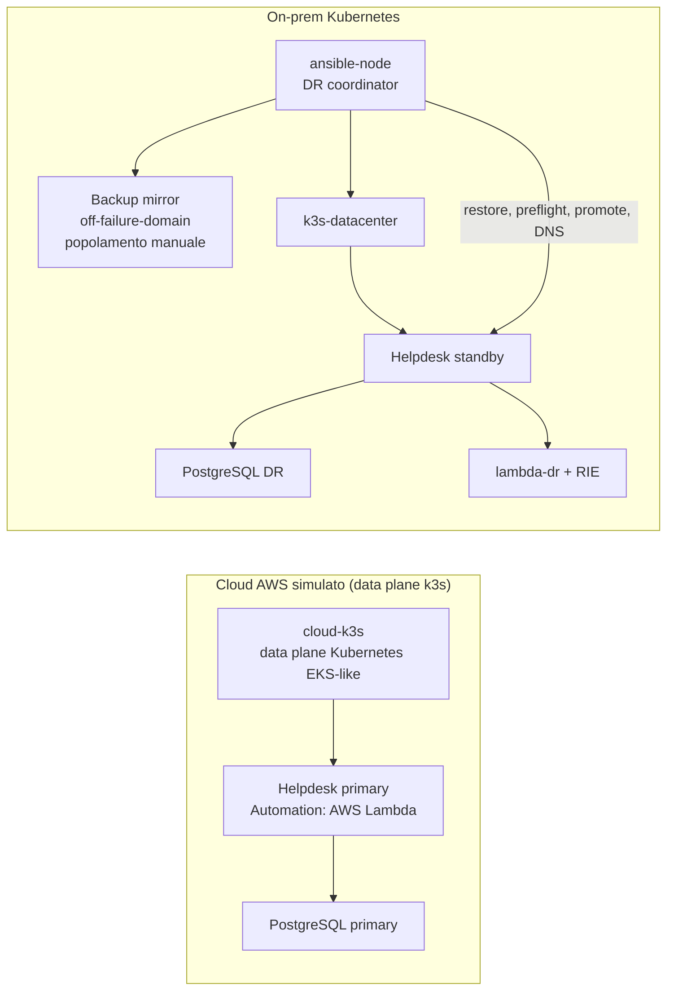

# Runbook Reverse DR production-like

## Obiettivo

La PoC separa i failure domain e mantiene lo stesso contratto applicativo nei due siti:



**Cloud-primary-via-LocalStack dismesso.** Questa PoC simulava in precedenza le API AWS (EKS/S3/IAM/Lambda) del sito cloud tramite LocalStack. La simulazione e' stata rimossa: il progetto non simula piu' l'infrastruttura AWS via LocalStack. La copertura AWS reale (EKS, S3, IAM, Lambda) resta quella della generazione corrente (`automazione/infra/aws`). Di conseguenza:

- `cloud-k3s` resta il data plane Kubernetes EKS-like, ma non c'e' piu' un control plane AWS simulato dietro di esso;
- il modo `AUTOMATION_MODE=aws-lambda` del primary richiede `AWS_ENDPOINT_URL` (vedi `automazione/helpdesk-dr/app/automation.py`): senza LocalStack questa variabile non viene piu' impostata dal manifest cloud, quindi l'automazione lato primary fallisce esplicitamente finche' non viene ricollegata a un endpoint Lambda reale o a un altro emulatore;
- il backup periodico cloud -> S3 e il relativo mirror on-prem, prima automatizzati via LocalStack S3, sono stati rimossi: il restore on-prem (`scripts/restore/restore-onprem.sh`, invariato) richiede un backup gia' presente in `BACKUP_MIRROR_DIR` su `ansible-node`, da produrre e copiare manualmente.

## Ordine di provisioning

Tutti i comandi seguenti vanno eseguiti da Ubuntu WSL nella root del repository.

### 1. Rete on-prem

```bash
cd automazione/lxc-lab
bash setup.sh
bash healthcheck.sh
cd ../..
```

Crea router, DNS, Git, `ansible-node`, `k3s-datacenter` e i segmenti di rete isolati.

### 2. Data plane Kubernetes cloud e on-prem

```bash
cd automazione/helpdesk-dr
bash scripts/poc/setup-cloud-sim.sh
bash scripts/poc/setup-onprem-k3s.sh
cd ../..
```

Il cluster `cloud-k3s` rappresenta il data plane Kubernetes cloud: i nodi ricevono label di regione, availability zone, instance type e `reverse-dr.io/eks-simulator=true`.

### 3. Workload cloud e runtime on-prem

```bash
cd automazione/helpdesk-dr
bash scripts/deploy/build-helpdesk-image.sh
bash scripts/deploy/deploy-cloud-primary.sh
bash scripts/deploy/deploy-lambda-onprem.sh
bash scripts/deploy/deploy-onprem-standby.sh
```

Il primary usa `AUTOMATION_MODE=aws-lambda`; lo standby usa `AUTOMATION_MODE=lambda-dr`. La selezione avviene via configurazione Kubernetes, non con branching nella logica applicativa. Con LocalStack rimosso, il percorso `aws-lambda` del primary non ha piu' un endpoint configurato di default (vedi nota in "Obiettivo").

### 4. Rendere Ansible il coordinatore DR

```bash
bash scripts/poc/bootstrap-ansible-control-node.sh
bash scripts/poc/ansible-run.sh poc/healthcheck
```

Il bootstrap pubblica il repository sul Git server, prepara `/opt/helpdesk-dr` su `ansible-node` e installa Ansible.

Il bootstrap abilita inoltre `boot.autostart=true` su `ansible-node`, così il coordinatore DR riparte automaticamente dopo un riavvio del daemon LXD o di WSL. Lo stop di `cloud-k3s` non arresta né riavvia il nodo Ansible.

Per coordinare LXD, `ansible-node` usa solo il client dello snap: il relativo daemon annidato viene disabilitato e un proxy collega il client al socket del daemon host. Questo accesso equivale a privilegi root sull'host LXD: è un trust boundary intenzionale del lab e richiede che il nodo Ansible sia dedicato, amministrato e non accessibile a utenti non fidati.

Prima del drill, copia manualmente un backup verificato (`helpdesk-<timestamp>.sql.gz` + `.sha256`) dentro `BACKUP_MIRROR_DIR/BACKUP_S3_PREFIX` su `ansible-node`: il timer automatico che popolava questo mirror da LocalStack S3 e' stato rimosso insieme a LocalStack.

## Verifica funzionale prima del DR

Crea un ticket dal client aziendale:

```bash
ticket_id="$(lxc exec pc-dipendente1 -- curl -fsS \
  -H 'content-type: application/json' \
  -d '{"title":"Test Lambda cloud","description":"Verifica percorso cloud","priority":"normal"}' \
  http://helpdesk.azienda.lan/tickets | python3 -c 'import json,sys; print(json.load(sys.stdin)["id"])')"
```

Invoca l'automazione:

```bash
lxc exec pc-dipendente1 -- curl -fsS -X POST \
  "http://helpdesk.azienda.lan/tickets/${ticket_id}/automation"
```

Prima del DR la risposta deve includere:

```json
{"provider":"aws-lambda","runtime":"aws-lambda-cloud"}
```

Questa chiamata richiede che `AWS_ENDPOINT_URL` sia configurato per il primary (vedi nota in "Obiettivo"); senza LocalStack va puntato a un endpoint Lambda reale o a un altro emulatore AWS a scelta.

## Disaster recovery drill

### Guasto EKS/data plane

```bash
lxc stop cloud-k3s --force
bash scripts/poc/ansible-run.sh failover/dr-controller oneshot
```

La probe del controller è passiva: non riavvia il primary. Il playbook Ansible:

1. seleziona il backup più recente dal mirror on-prem;
2. verifica SHA-256;
3. ripristina PostgreSQL su `k3s-datacenter`;
4. verifica adapter e funzione `lambda-dr`;
5. abilita la readiness on-prem;
6. cambia il record DNS autorevole.

Questa prova funziona solo se il mirror on-prem contiene gia' un backup verificato (vedi "Rendere Ansible il coordinatore DR").

## Verifica dopo il DR

```bash
bash scripts/poc/ansible-run.sh poc/healthcheck
lxc exec pc-dipendente1 -- curl -fsS http://helpdesk.azienda.lan/dr-status
lxc exec pc-dipendente1 -- curl -fsS -X POST \
  "http://helpdesk.azienda.lan/tickets/${ticket_id}/automation"
```

La seconda invocazione deve includere:

```json
{"provider":"lambda-dr","runtime":"lambda-rie-onprem"}
```

## RPO e RTO misurabili

- RPO: dipende dall'eta' dell'ultimo backup copiato manualmente in `BACKUP_MIRROR_DIR` su `ansible-node` (il backup automatico cloud -> S3 -> mirror e' stato rimosso insieme a LocalStack);
- RTO: restore PostgreSQL + rollout/readiness + aggiornamento DNS;
- TTL DNS: 30 secondi.

Per un RPO on-prem stringente occorre reintrodurre un meccanismo di backup/sync periodico (verso AWS reale o altro storage), sostituendo il polling manuale con replica S3 cross-region/event-driven oppure streaming WAL continuo. La PoC attuale privilegia leggibilità e verificabilità del processo di restore/failover, non l'automazione del trasporto del backup.

## Limiti dichiarati

- Il control plane AWS simulato via LocalStack e' stato rimosso: `cloud-k3s` resta il data plane Kubernetes EKS-like, ma senza un emulatore AWS dietro. Il primary in modalita' `AUTOMATION_MODE=aws-lambda` fallisce esplicitamente finche' `AWS_ENDPOINT_URL` non viene ricollegato a un endpoint Lambda reale o a un altro emulatore.
- Il backup periodico cloud -> S3 e il mirror automatico on-prem sono stati rimossi insieme a LocalStack: il popolamento di `BACKUP_MIRROR_DIR` e' oggi manuale.
- `cloud-k3s` e `k3s-datacenter` sono cluster mononodo.
- PostgreSQL usa dump/restore, non replica WAL o managed RDS.
- Il cutback resta manuale perché manca la replica dei dati modificati durante il periodo DR verso il primary.
- I container k3s LXD privilegiati sono una concessione del laboratorio, non una configurazione production.
