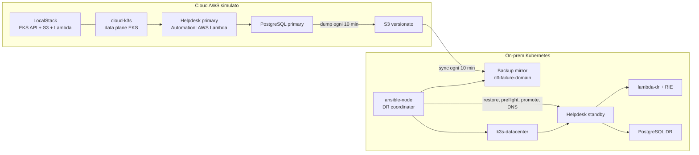

# Runbook Reverse DR production-like

## Obiettivo

La PoC separa i failure domain e mantiene lo stesso contratto applicativo nei due siti:



LocalStack EKS richiede un piano Ultimate, Enterprise o Student. La modalità `EKS_K8S_PROVIDER=local` registra `cloud-k3s` come data plane associato all'API EKS simulata. Per evitare problemi di routing tra Docker Desktop e le reti LXD, eseguire Docker Engine nella stessa distribuzione Ubuntu WSL che ospita LXD.

## Ordine di provisioning

Tutti i comandi seguenti vanno eseguiti da Ubuntu WSL nella root del repository.

### 1. Rete on-prem

```bash
cd automazione/lxc-lab
bash setup.sh
bash healthcheck.sh
cd ../..
```

Crea router, DNS, Git, `ansible-node`, `k3s-datacenter` e i segmenti di rete isolati.

### 2. Data plane Kubernetes cloud e on-prem

```bash
cd automazione/helpdesk-dr
bash scripts/poc/setup-cloud-sim.sh
bash scripts/poc/setup-onprem-k3s.sh
cd ../..
```

Il setup cloud esporta anche il kubeconfig X509 in `automazione/localstack/.state/cloud-kubeconfig`, usato da LocalStack per registrare l'API EKS.

### 3. Control plane AWS simulato

```bash
export LOCALSTACK_AUTH_TOKEN='<token LocalStack>'
cd automazione/localstack
bash scripts/start.sh
cd ../..
```

L'init idempotente crea:

- VPC `10.20.0.0/16` e due subnet/AZ;
- cluster EKS logico `helpdesk-cloud`;
- bucket S3 versionato `reverse-dr-helpdesk-backups`;
- Lambda cloud `helpdesk-ticket-processor`;
- ruoli IAM per EKS e Lambda.

### 4. Workload cloud e runtime on-prem

```bash
cd automazione/helpdesk-dr
bash scripts/deploy/build-helpdesk-image.sh
bash scripts/deploy/deploy-cloud-primary.sh
bash scripts/deploy/deploy-lambda-onprem.sh
bash scripts/deploy/deploy-onprem-standby.sh
```

Il primary usa `AUTOMATION_MODE=aws-lambda`; lo standby usa `AUTOMATION_MODE=lambda-dr`. La selezione avviene via configurazione Kubernetes, non con branching nella logica applicativa.

### 5. Backup ogni 10 minuti

```bash
bash scripts/backup/backup-cloud.sh
bash scripts/backup/install-cloud-backup-timer.sh
```

Ogni backup è compresso, accompagnato da SHA-256 e caricato nel bucket S3. Il timer usa `OnCalendar=*:0/10`, quindi gira ai minuti `00,10,20,30,40,50`.

### 6. Rendere Ansible il coordinatore DR

```bash
bash scripts/poc/bootstrap-ansible-control-node.sh
bash scripts/poc/ansible-run.sh backup/sync-backups-onprem
bash scripts/poc/ansible-run.sh poc/healthcheck
```

Il bootstrap pubblica il repository sul Git server, prepara `/opt/helpdesk-dr` su `ansible-node`, installa AWS CLI/Ansible e abilita il timer di mirror. Il mirror gira ai minuti `05,15,25,35,45,55`, fuori dal failure domain cloud.

## Verifica funzionale prima del DR

Crea un ticket dal client aziendale:

```bash
ticket_id="$(lxc exec pc-dipendente1 -- curl -fsS \
  -H 'content-type: application/json' \
  -d '{"title":"Test Lambda cloud","description":"Verifica percorso cloud","priority":"normal"}' \
  http://helpdesk.azienda.lan/tickets | python3 -c 'import json,sys; print(json.load(sys.stdin)["id"])')"
```

Invoca l'automazione:

```bash
lxc exec pc-dipendente1 -- curl -fsS -X POST \
  "http://helpdesk.azienda.lan/tickets/${ticket_id}/automation"
```

Prima del DR la risposta deve includere:

```json
{"provider":"aws-lambda","runtime":"localstack-cloud"}
```

Forza un backup e sincronizzalo off-site prima del drill:

```bash
bash scripts/backup/backup-cloud.sh
bash scripts/poc/ansible-run.sh backup/sync-backups-onprem
```

## Disaster recovery drill

### Guasto EKS/data plane

```bash
lxc stop cloud-k3s --force
bash scripts/poc/ansible-run.sh failover/dr-controller oneshot
```

La probe del controller è passiva: non riavvia il primary. Il playbook Ansible:

1. seleziona il backup più recente dal mirror on-prem;
2. verifica SHA-256;
3. ripristina PostgreSQL su `k3s-datacenter`;
4. verifica adapter e funzione `lambda-dr`;
5. abilita la readiness on-prem;
6. cambia il record DNS autorevole.

### Guasto cloud completo

Per dimostrare che il restore non dipende da LocalStack durante l'incidente:

```bash
lxc stop cloud-k3s --force
cd ../localstack
bash scripts/stop.sh
cd ../helpdesk-dr
bash scripts/poc/ansible-run.sh failover/dr-controller oneshot
```

Questa prova funziona solo se il mirror Ansible è già stato sincronizzato.

## Verifica dopo il DR

```bash
bash scripts/poc/ansible-run.sh poc/healthcheck
lxc exec pc-dipendente1 -- curl -fsS http://helpdesk.azienda.lan/dr-status
lxc exec pc-dipendente1 -- curl -fsS -X POST \
  "http://helpdesk.azienda.lan/tickets/${ticket_id}/automation"
```

La seconda invocazione deve includere:

```json
{"provider":"lambda-dr","runtime":"lambda-rie-onprem"}
```

## RPO e RTO misurabili

- backup cloud: ogni 10 minuti;
- mirror on-prem: ogni 10 minuti, sfalsato di 5 minuti;
- RPO massimo teorico della copia on-prem: circa 15 minuti;
- RTO: restore PostgreSQL + rollout/readiness + aggiornamento DNS;
- TTL DNS: 30 secondi.

Per sostenere un RPO on-prem effettivo di 10 minuti occorre sostituire il polling con replica S3 cross-region/event-driven oppure streaming WAL continuo. La PoC attuale privilegia leggibilità e verificabilità del processo.

## Limiti dichiarati

- LocalStack riproduce le API e il comportamento utile alla PoC, non l'HA fisica multi-AZ di AWS EKS.
- `cloud-k3s` e `k3s-datacenter` sono cluster mononodo.
- PostgreSQL usa dump/restore, non replica WAL o managed RDS.
- Il cutback resta manuale perché manca la replica dei dati modificati durante il periodo DR verso il primary.
- Le credenziali `test` sono accettabili solo per LocalStack; non devono diventare credenziali AWS reali.
- I container k3s LXD privilegiati sono una concessione del laboratorio, non una configurazione production.
