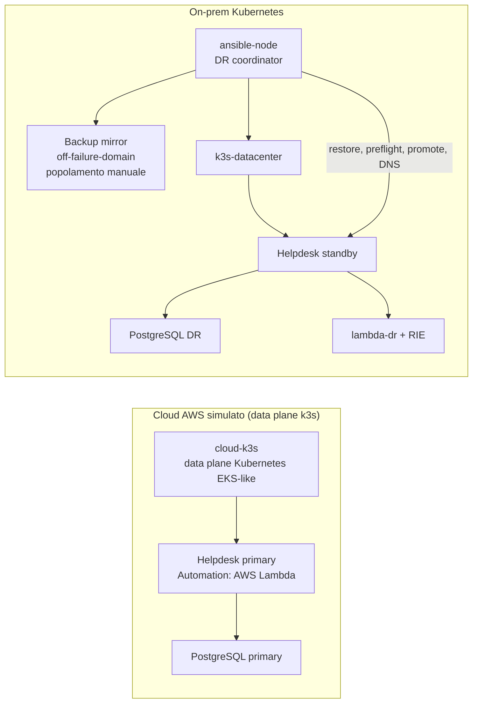

# Runbook Reverse DR production-like

## Obiettivo

La PoC separa i failure domain e mantiene lo stesso contratto applicativo nei due siti:



**Cloud-primary-via-LocalStack dismesso.** Questa PoC simulava in precedenza le API AWS (EKS/S3/IAM/Lambda) del sito cloud tramite LocalStack. La simulazione e' stata rimossa: il progetto non simula piu' l'infrastruttura AWS via LocalStack. La copertura AWS reale (EKS, S3, IAM, Lambda) resta quella della generazione corrente (`automazione/infra/aws`). Di conseguenza:

- `cloud-k3s` resta il data plane Kubernetes EKS-like, ma non c'e' piu' un control plane AWS simulato dietro di esso;
- il backup periodico cloud -> S3 e il relativo mirror on-prem, prima automatizzati via LocalStack S3, sono stati rimossi: il restore on-prem (`scripts/restore/restore-onprem.sh`) richiede un backup gia' presente in `BACKUP_MIRROR_DIR` su `ansible-node`, da produrre e copiare manualmente.

**Monolite `helpdesk-api` rimosso.** L'applicazione della prima versione della PoC
(un monolite FastAPI senza frontend) e' stata eliminata insieme al suo overlay
cloud, all'immagine di build e all'endpoint `/dr-status`. L'unica applicazione e'
ora Helios (`automazione/apps`, `automazione/infra/onprem`), e le verifiche
funzionali passano dal BFF su `/api/v1`. Di conseguenza:

- su `cloud-k3s` non gira piu' alcun workload applicativo: resta il data plane
  Kubernetes come dominio di guasto spegnibile dal drill, e `dr-controller.sh` lo
  sonda tramite `/readyz` dell'API server invece che via HTTP applicativo;
- `AUTOMATION_MODE` resta il selettore del runtime della function, ma vive ora in
  `helios-automation-service`: `aws-lambda` sul primario AWS reale, `lambda-dr`
  sul sito DR (vedi `automazione/apps/functions/ticket-processor/README.md`);
- la promozione on-prem fallisce esplicitamente se l'overlay Helios non e'
  installato, invece di ricadere su un'applicazione legacy inesistente.

## Ordine di provisioning

Tutti i comandi seguenti vanno eseguiti da Ubuntu WSL nella root del repository.

### 1. Rete on-prem

```bash
# 1. Imposta la policy FORWARD su ACCEPT ed abilita il traffico su lxdbr0
sudo iptables -P FORWARD ACCEPT
sudo iptables -I FORWARD -i lxdbr0 -j ACCEPT
sudo iptables -I FORWARD -o lxdbr0 -j ACCEPT

# 2. Verifica la connettività da dentro il container
lxc exec server-dns -- ping -c 2 8.8.8.8

# se non si fanno i comandi precedenti non si riesce a fare il setup
cd automazione/lxc-lab
bash setup.sh
bash healthcheck.sh
cd ../..
```

Crea router, DNS, Git, `ansible-node`, `k3s-datacenter` e i segmenti di rete isolati.

### 2. Data plane Kubernetes cloud e on-prem

```bash
cd automazione/helpdesk-dr
bash scripts/poc/setup-cloud-sim.sh
bash scripts/poc/setup-onprem-k3s.sh
cd ../..
```

Il cluster `cloud-k3s` rappresenta il data plane Kubernetes cloud: i nodi ricevono label di regione, availability zone, instance type e `reverse-dr.io/eks-simulator=true`.

### 3. Runtime lambda-dr e standby on-prem

```bash
cd automazione/infra/onprem
bash ../vault/scripts/seed-secrets.sh
# Auto-unseal: opt-in, richiede OPENBAO_UNSEAL_KEYS e la conferma esplicita
# OPENBAO_ACCEPT_AUTO_UNSEAL_RISK=yes. Vedi ../vault/README.md.
bash ../vault/scripts/enable-auto-unseal.sh

cd ../../helpdesk-dr
bash scripts/deploy/deploy-lambda-onprem.sh
bash scripts/deploy/deploy-onprem-standby.sh

cd ../infra/onprem
bash scripts/apply-migrations.sh
bash scripts/provision-dr-operator.sh
```

Non esiste piu' un passo di deploy del workload cloud: il monolite e' stato
rimosso e il sito primario reale e' AWS EKS. Lo standby usa
`AUTOMATION_MODE=lambda-dr`, il primario `AUTOMATION_MODE=aws-lambda`: la
selezione avviene via configurazione Kubernetes, non con branching nella logica
applicativa.

### 4. Rendere Ansible il coordinatore DR

```bash
bash scripts/poc/bootstrap-ansible-control-node.sh
bash scripts/poc/ansible-run.sh poc/healthcheck
```

Il bootstrap pubblica il repository sul Git server, prepara `/opt/helpdesk-dr` su `ansible-node` e installa Ansible.

Il bootstrap abilita inoltre `boot.autostart=true` su `ansible-node`, così il coordinatore DR riparte automaticamente dopo un riavvio del daemon LXD o di WSL. Lo stop di `cloud-k3s` non arresta né riavvia il nodo Ansible.

Per coordinare LXD, `ansible-node` usa solo il client dello snap: il relativo daemon annidato viene disabilitato e un proxy collega il client al socket del daemon host. Questo accesso equivale a privilegi root sull'host LXD: è un trust boundary intenzionale del lab e richiede che il nodo Ansible sia dedicato, amministrato e non accessibile a utenti non fidati.

Prima del drill, copia manualmente un backup verificato (`helpdesk-<timestamp>.sql.gz` + `.sha256`) dentro `BACKUP_MIRROR_DIR/BACKUP_S3_PREFIX` su `ansible-node`: il timer automatico che popolava questo mirror da LocalStack S3 e' stato rimosso insieme a LocalStack.

## Verifica funzionale prima del DR

Le API sono ora dietro il BFF, che richiede una sessione browser (cookie
`__Host-*` + CSRF): la verifica si fa dalla dashboard, non con `curl` anonimo.

1. Apri `https://helpdesk.azienda.lan/` dal client aziendale e autenticati.
2. Crea un ticket dalla dashboard.
3. Aprilo, e nel pannello "Automazione ticket" premi **Esegui**.

Prima del DR il pannello deve mostrare `aws-lambda` come esecutore e
`aws-lambda-cloud` come runtime. La colonna operativa mostra inoltre RPO e RTO
misurati; se non è mai stato eseguito un failover, l'RTO è "Mai misurato".

## Disaster recovery drill

### Guasto EKS/data plane

```bash
lxc stop cloud-k3s --force
bash scripts/poc/ansible-run.sh failover/dr-controller oneshot
```

La probe del controller è passiva: non riavvia il primary. Il playbook Ansible:

1. seleziona il backup più recente dal mirror on-prem;
2. verifica SHA-256;
3. ripristina PostgreSQL su `k3s-datacenter`;
4. verifica adapter e funzione `lambda-dr`;
5. abilita la readiness on-prem;
6. cambia il record DNS autorevole.

Questa prova funziona solo se il mirror on-prem contiene gia' un backup verificato (vedi "Rendere Ansible il coordinatore DR").

## Verifica dopo il DR

```bash
bash scripts/poc/ansible-run.sh poc/healthcheck
```

Poi, dalla dashboard (nuova autenticazione, questa volta su Keycloak):

1. `GET /api/v1/session` riporta `site.mode = dr` e `site.identityProvider = keycloak`;
   in UI l'intestazione mostra il sito DR.
2. Rilancia **Esegui** sullo stesso ticket: il pannello deve ora mostrare
   `lambda-dr` come esecutore e `lambda-rie-onprem` come runtime — stessa
   function, runtime diverso.
3. La colonna operativa mostra l'RTO appena misurato dal playbook.

L'endpoint `/dr-status` del monolite non esiste piu': il sito attivo si legge da
`/api/v1/session`.

## RPO e RTO misurabili

Le due metriche non sono piu' dichiarate a mano: vengono **scritte da chi esegue
l'operazione** nella tabella `dr_telemetry` del database applicativo, lette dal
BFF su `GET /api/v1/platform/status` e mostrate nella colonna operativa della
dashboard.

| Metrica | Chi la scrive | Che cosa misura | Obiettivo di default |
|---|---|---|---|
| `backup.last_success` | CronJob `helios-postgres-backup` dopo l'upload S3 | eta' dell'ultimo backup completato = RPO | 900 s (`RPO_TARGET_SECONDS`) |
| `failover.last_promotion` | `failover.yml` via `scripts/failover/record-dr-telemetry.sh` | durata dell'orchestrazione di failover = RTO | 1800 s (`RTO_TARGET_SECONDS`) |

Cosa comprende l'RTO misurato: restore PostgreSQL, preflight identita', rollout e
readiness dei workload, aggiornamento DNS. Cosa **non** comprende: il tempo di
rilevamento del guasto, perche' il cronometro parte quando il playbook parte. La
dashboard lo dichiara esplicitamente sotto la metrica.

Se una metrica non e' mai stata registrata, l'API e la UI mostrano `unknown` /
"Mai misurato": e' l'esito onesto, non un valore di comodo. TTL DNS: 30 secondi.

La tabella `dr_telemetry` viene creata da
`apps/backend/services/bff/migrations/002_dr_telemetry.sql`, applicata insieme
alle altre migrazioni da `infra/onprem/scripts/apply-migrations.sh`. Senza quella
migrazione i due writer falliscono e la dashboard resta a "Mai misurato".

Nota sull'RPO in questa PoC: la metrica misura correttamente l'eta' dell'ultimo
backup **prodotto sul primario**, ma il trasporto del backup verso il mirror
on-prem resta manuale (vedi "Limiti dichiarati"). L'RPO mostrato e' quindi un
limite inferiore del RPO reale del sito DR finche' il trasporto non e' automatico.

Per un RPO on-prem stringente occorre reintrodurre un meccanismo di backup/sync periodico (verso AWS reale o altro storage), sostituendo il polling manuale con replica S3 cross-region/event-driven oppure streaming WAL continuo. La PoC attuale privilegia leggibilità e verificabilità del processo di restore/failover, non l'automazione del trasporto del backup.

## Limiti dichiarati

- Il control plane AWS simulato via LocalStack e' stato rimosso: `cloud-k3s` resta il data plane Kubernetes EKS-like, ma senza un emulatore AWS dietro e, dopo la rimozione del monolite, senza workload applicativi. Il percorso `AUTOMATION_MODE=aws-lambda` e' quindi verificabile solo sul primario AWS reale, non in laboratorio.
- Il drill spegne `cloud-k3s`, cioe' il dominio di guasto del *lab*, non il sito primario AWS: la parte di failover che il laboratorio dimostra e' la promozione on-prem, non l'indisponibilita' di EKS.
- Il backup periodico cloud -> S3 e il mirror automatico on-prem sono stati rimossi insieme a LocalStack: il popolamento di `BACKUP_MIRROR_DIR` e' oggi manuale.
- `cloud-k3s` e `k3s-datacenter` sono cluster mononodo.
- PostgreSQL usa dump/restore, non replica WAL o managed RDS.
- Il cutback resta manuale perché manca la replica dei dati modificati durante il periodo DR verso il primary.
- La metrica RPO misura l'eta' dell'ultimo backup prodotto sul primario, non l'eta' del backup effettivamente disponibile on-prem: finche' il trasporto verso `BACKUP_MIRROR_DIR` e' manuale, il RPO reale del sito DR puo' essere peggiore di quello mostrato.
- La metrica RTO copre solo la durata del playbook: il tempo di rilevamento del guasto (intervallo di polling di `dr-controller.sh` per la soglia di fallimenti) va sommato a parte per ottenere l'RTO percepito dall'utente.
- I container k3s LXD privilegiati sono una concessione del laboratorio, non una configurazione production.
