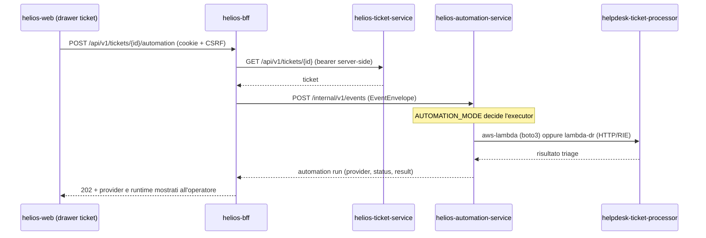

# Function `helpdesk-ticket-processor`

Function di triage eseguita quando l'operatore lancia l'automazione di un ticket
dalla dashboard. È il punto in cui la PoC rende **osservabile** la differenza fra
sito primario e sito DR: stesso codice, due runtime.

| | Sito primario | Sito DR |
| --- | --- | --- |
| Runtime | AWS Lambda (immagine container ECR) | AWS Lambda RIE su k3s (`lambda-dr`) |
| Invocazione | `boto3` `Invoke` da `helios-automation-service` | HTTP verso `event-adapter` |
| Selettore | `AUTOMATION_MODE=aws-lambda` | `AUTOMATION_MODE=lambda-dr` |
| Artefatto | `reverse-dr-poc-ticket-processor` (ECR) | ConfigMap `lambda-helpdesk-ticket-processor-code` |
| Risposta | `{provider: aws-lambda, runtime: aws-lambda-cloud}` | `{provider: lambda-dr, runtime: lambda-rie-onprem}` |

Il runtime **non è scelto dal codice**: né la function né il codice applicativo
contengono un `if site == "dr"`. La scelta è deployment (`AUTOMATION_MODE` +
`HELIOS_FUNCTION_*`), coerentemente con `contracts/deployment-contract.json`.

## Percorso completo di una esecuzione



## Due forme di evento, un solo risultato applicativo

I due percorsi consegnano payload diversi, e questo è il dettaglio che rende
l'invariante non banale:

- **invoke diretta AWS**: il payload *è* l'`EventEnvelope` Helios (ticket in
  `data.ticket`) e l'executor usa la risposta come risultato dell'automation
  run, quindi la function deve restituire **l'oggetto risultato nudo**;
- **percorso DR**: `event-adapter` costruisce un evento API Gateway proxy (ticket
  nel `body`) e si aspetta indietro `{statusCode, headers, body}`.

Rispondere sempre con l'envelope proxy renderebbe il risultato del primario
diverso da quello del DR — cioè romperebbe proprio l'invariante che la PoC vuole
dimostrare. `handler.py` normalizza l'ingresso e adatta l'uscita; il test
`test_both_runtimes_produce_the_same_business_result` la verifica.

## Sorgente unica e copia on-prem

`handler.py` è la sorgente di verità. `lambda-dr` monta il codice da un ConfigMap
versionato: Kustomize non può generare un ConfigMap da un file fuori dalla
propria root, quindi la copia inline è necessaria. Per non farle divergere:

```bash
python automazione/apps/functions/ticket-processor/sync-onprem-configmap.py
```

`automazione/tests/deployment-contract.ps1` fallisce se le due copie divergono.

## Build dell'immagine primaria

Il Dockerfile va costruito dalla root del repository, perché copia dal percorso
completo del monorepo:

```bash
docker build -f automazione/apps/functions/ticket-processor/Dockerfile -t <ecr>/reverse-dr-poc-ticket-processor:<tag> .
```

L'URI immagine va poi passato a Terraform come `lambda_image_uri`: senza di esso
il modulo `automation` non crea la Lambda (scelta esistente, non modificata).

## Test

```bash
cd automazione/apps/backend
.venv/Scripts/python.exe -m pytest tests/unit/test_ticket_processor_function.py -v
```

I test vivono nella suite backend perché è l'unica suite Python del repo; la
function resta comunque fuori da `src/`, non essendo un microservizio.

## Limiti dichiarati

- La logica di triage (classificazione, SLA, coda suggerita) è **di laboratorio**:
  serve a produrre un risultato deterministico e verificabile durante un drill,
  non riflette uno SLA contrattuale reale.
- La function non scrive su database e non emette eventi: è volutamente pura, così
  un fallimento del percorso DR non lascia stato inconsistente da riconciliare.
- L'immagine non è pinnata per digest; vale la stessa nota di produzione già
  presente in `infra/onprem/README.md`.
