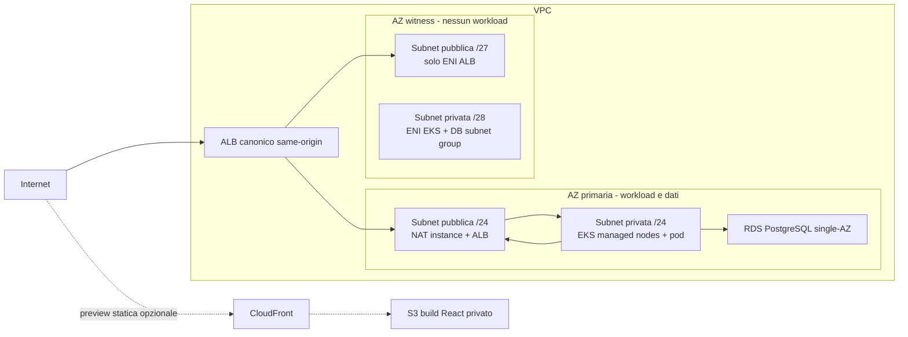

# AWS primary PoC infrastructure

Terraform production-like per il primary AWS della piattaforma Reverse DR. Lo stack è intenzionalmente **cost-conscious e non HA**: nodi EKS, pod, NAT e istanza RDS risiedono in una sola Availability Zone primaria. Non contiene credenziali, non pubblica immagini e non esegue alcun `apply`.

## Perché esiste una seconda AZ

Una configurazione EKS + ALB letteralmente mono-AZ non è applicabile su AWS:

- la creazione di un cluster EKS richiede almeno due subnet in AZ diverse ([requisiti EKS](https://docs.aws.amazon.com/eks/latest/userguide/network-reqs.html));
- un Application Load Balancer regionale richiede almeno due subnet, in AZ diverse, con almeno una `/27` e otto IP liberi per AZ ([requisiti ALB](https://docs.aws.amazon.com/elasticloadbalancing/latest/application/application-load-balancers.html#subnets-load-balancer)).

Questo stack usa quindi una **AZ witness**, non una seconda AZ applicativa:



Il control plane EKS resta un servizio gestito AWS e non è reso mono-AZ. Il managed node group riceve **solo** la subnet privata primaria. RDS usa un DB subnet group a due AZ, come richiesto dal servizio, ma `multi_az = false` e `availability_zone` è fissata alla primaria. Le subnet witness sono minime, configurabili e marcate `Workloads=prohibited`.

## Risorse

| Area | Risorse e scelte |
|---|---|
| Network | VPC, DNS, due subnet primarie e due witness, Internet Gateway, route table separate |
| Egress | EC2 `t4g.nano` Amazon Linux 2023 come NAT instance, EIP, nessun SSH, IMDSv2 obbligatorio |
| Compute | EKS, un managed node group EC2 nella sola AZ primaria, AL2023, volumi gp3 cifrati |
| Add-on | VPC CNI e EBS CSI con IRSA dedicata, CoreDNS, kube-proxy |
| Ingress | subnet taggate e ruolo IRSA per AWS Load Balancer Controller; l'ALB nasce solo quando viene applicato un Ingress Kubernetes |
| Registry | ECR immutabile e scan-on-push per `frontend`, `bff`, `ticket`, `automation`, `ticket-processor` |
| Data | RDS PostgreSQL single-AZ, password master generata da RDS in Secrets Manager, TLS/IAM DB auth disponibili |
| Storage | bucket S3 privato/versionato per backup logici e bucket origine privato per build React |
| Edge | CloudFront opzionale con Origin Access Control, HTTPS, HTTP/2+3, header di sicurezza e fallback SPA |
| Eventi | EventBridge custom bus e archive di 7 giorni, SQS long-polling e DLQ |
| Lambda | consumer container opzionale, attivato solo con un URI ECR; concorrenza massima 2 |
| Identity | ruoli IRSA separati per BFF, ticket service, automation worker e job backup |
| Logging | log EKS API/audit/authenticator e RDS PostgreSQL; log Lambda se abilitata; VPC flow logs opzionali |

Non vengono creati Route 53, certificati ACM, WAF, NAT Gateway, Redis/ElastiCache o ALB direttamente. Queste omissioni evitano costi fissi o richiedono ownership esterna (DNS/certificati). Il controller ALB è predisposto ma va installato nel cluster.

L'endpoint applicativo canonico è l'ALB EKS: `/api/*` raggiunge `helios-bff:8000` e `/` raggiunge `helios-web:8080` sullo stesso host HTTPS, requisito necessario per cookie `__Host-*`, CSRF e callback OIDC. La distribution CloudFront, disabilitata per default da `enable_cloudfront_frontend = false`, serve solo build/preview statiche e **non** instrada `/api`; non va usata come endpoint dell'applicazione autenticata.

## Contratto di naming

Con i valori predefiniti il prefisso è `reverse-dr-poc`:

- cluster EKS: `reverse-dr-poc`;
- node group: `reverse-dr-poc-primary`;
- RDS: `reverse-dr-poc-postgres`;
- ECR: `reverse-dr-poc-frontend`, `reverse-dr-poc-bff`, `reverse-dr-poc-ticket`, `reverse-dr-poc-automation`, `reverse-dr-poc-ticket-processor`;
- bus: `reverse-dr-poc-application`;
- queue: `reverse-dr-poc-ticket-automation`;
- namespace Kubernetes: `helios-desk`.

I nomi S3 includono account ID e regione per essere globalmente unici. Usare gli output, non ricostruirli nei manifest o nella CI.

## Segreti e accesso workload

Terraform non riceve password né valori OIDC:

1. RDS genera la password bootstrap e mantiene il secret master. Nessun ruolo applicativo può leggerlo.
2. Terraform crea soltanto due contenitori Secrets Manager senza `SecretVersion`:
   - `.../application/database` per un utente PostgreSQL applicativo ristretto;
   - `.../application/config` per client secret OIDC, chiave di cifratura delle sessioni BFF e altri valori server-side.
3. Un bootstrap operativo crea l'utente DB, valorizza i due secret e configura la rotazione fuori da Terraform.

Shape suggerite, senza valori reali:

```json
{
  "database": {
    "DATABASE_URL": "postgresql+asyncpg://<restricted-user>:<secret>@<rds-address>:5432/helios?ssl=require"
  },
  "config": {
    "OIDC_CLIENT_PRIVATE_KEY": "<PEM PKCS#8 della chiave privata del certificato BFF>",
    "OIDC_CLIENT_CERTIFICATE": "<PEM del certificato registrato sull'application BFF>",
    "SESSION_ENCRYPTION_KEY": "<random-32-byte-or-longer-secret>"
  }
}
```

Il primario **non usa un client secret**: la policy del tenant aziendale lo vieta, quindi il BFF si autentica sul token endpoint con una client assertion firmata (`private_key_jwt`, RFC 7523) e la credenziale confidenziale è la chiave privata del certificato registrato sull'application. Il certificato accompagna la chiave perché serve a derivare l'impronta `x5t` con cui Entra individua quale credenziale ha firmato. Il selettore è `OIDC_CLIENT_AUTH_METHOD` nel ConfigMap: il sito DR resta su `client_secret`, perché il suo Keycloak è locale e non soggetto a quella policy. È configurazione per sito, non un branch nel codice.

Issuer, client ID e audience Entra sono non-secret e restano nel ConfigMap cloud. Le application registration sono create e gestite dal **team identità aziendale**, fuori da questo repository: l'audience è un input esterno documentato in `contracts/deployment-contract.json` (`identity.audience`), non un output derivabile da Terraform. Deve essere il GUID del client ID della API, non l'identifier URI `api://...`.

Il CronJob di backup ha bisogno anche di `psql`, non solo di `pg_dump`: dopo un
upload S3 riuscito registra la metrica `backup.last_success` nella tabella
`dr_telemetry`, che è la fonte dell'RPO mostrato dalla dashboard. La metrica
viene scritta **dopo** l'upload, non dopo il dump: dichiararla prima farebbe
misurare un RPO che il sito DR non potrebbe realmente rispettare.

Il BFF legge entrambi i secret perché persiste `bff_sessions` e `oauth_transactions` in PostgreSQL; non è previsto DynamoDB o Redis. I pod assumono ruoli tramite service account IRSA:

| Workload | Service account | Permessi AWS |
|---|---|---|
| BFF | `helios-desk/helios-bff` | read dei due secret applicativi |
| Ticket | `helios-desk/helios-ticket-service` | read secret + `events:PutEvents` solo sul bus applicativo |
| Automation | `helios-desk/helios-automation-service` | read secret + queue, più invoke della Lambda solo se abilitata |
| Backup | `helios-desk/helios-postgres-backup` | read secret DB + read/write solo `s3://<backup>/postgres/*` |

Annotare ogni service account con `eks.amazonaws.com/role-arn` usando `workload_irsa_role_arns`. Il controller ALB usa `load_balancer_controller_role_arn` sul service account `kube-system/aws-load-balancer-controller`. La policy è derivata e ridotta dalla policy ufficiale del controller `v3.4.2`; verificare la compatibilità prima di aggiornare il chart ([guida ufficiale](https://kubernetes-sigs.github.io/aws-load-balancer-controller/latest/deploy/installation/)).

## NAT: scelta economica e limiti

Un NAT Gateway ha costo orario e costo per GB anche con traffico minimo. Per questa PoC viene usata una singola `t4g.nano` con source/destination check disabilitato e regola MASQUERADE. È molto più economica a basso traffico, ma introduce:

- single point of failure;
- patching e sostituzione a carico del team;
- throughput e connection tracking limitati;
- breve interruzione durante un replace Terraform.

Non usare questa scelta come baseline production HA. Per produzione, passare a un NAT Gateway per AZ o a una soluzione egress centralizzata. I VPC Interface Endpoint non sono il default perché ECR, STS, Logs ed EKS richiederebbero più endpoint a costo orario; un S3 Gateway Endpoint da solo non coprirebbe bootstrap e pull delle immagini.

## Stima qualitativa dei costi

I prezzi cambiano per regione e data: verificare sempre con [AWS Pricing Calculator](https://calculator.aws/). La regione della PoC è `eu-south-1` (Milano), una regione **opt-in** da abilitare per account prima di qualsiasi `plan`. Ordine qualitativo atteso a basso traffico:

| Driver | Incidenza | Nota |
|---|---:|---|
| EKS control plane | alta/fissa | normalmente il costo dominante della PoC |
| 1 nodo `t3.medium` | media/fissa | `ON_DEMAND`; Spot è configurabile ma meno stabile |
| RDS `db.t4g.micro` + 20 GiB | medio-bassa | single-AZ, niente Performance Insights/Enhanced Monitoring |
| NAT `t4g.nano` + IPv4 pubblico | bassa/fissa | evita tariffa NAT Gateway; aggiunge onere operativo |
| ALB | media/fissa quando creato | assente finché non esiste un Ingress; LCU/data processing a consumo |
| S3, ECR, CloudFront opzionale | bassa a basso volume | cresce con artefatti, richieste e traffico uscente |
| EventBridge, SQS, Lambda | molto bassa a basso volume | Lambda è disabilitata senza image URI |
| CloudWatch | variabile | audit EKS sempre attivo; flow log disattivato per default |

Quando abilitato, CloudFront usa `PriceClass_100`. ECR mantiene le ultime 20 immagini; i backup passano a Glacier Instant Retrieval dopo 30 giorni e scadono dopo 365. Queste retention sono scelte PoC, non una policy legale/compliance.

## Prerequisiti e flusso `plan`

- Terraform `>= 1.10` (serve il lock file nativo del backend S3);
- AWS provider `>= 5.80, < 7`;
- un bucket state preesistente, versionato/cifrato e con policy di accesso dedicata;
- credenziali AWS temporanee tramite SSO/assume-role, mai in file `.tfvars`;
- permessi read/plan adeguati. Un `plan` interroga AWS e non è un'operazione offline.

Preparare solo file locali non versionati:

```powershell
Copy-Item backend.hcl.example backend.hcl
Copy-Item terraform.tfvars.example terraform.tfvars
```

Validazione offline/statica con provider mock:

```powershell
terraform fmt -check -recursive
terraform init -backend=false
terraform validate
terraform test
powershell.exe -NoProfile -ExecutionPolicy Bypass -File tests/static_contract.ps1
```

Inizializzazione del backend e creazione del piano revisionabile:

```powershell
terraform init -reconfigure -backend-config=backend.hcl
terraform plan -var-file=terraform.tfvars -out=reverse-dr-poc.tfplan
terraform show -no-color reverse-dr-poc.tfplan
```

Questo repository non autorizza né automatizza `terraform apply`. Prima di un apply reale occorre almeno:

- sostituire IP documentali, ARN amministrativi e parametri di dominio;
- stimare costi e quote;
- revisionare il piano e la policy IAM del controller;
- predisporre state backend, secret bootstrap e rollback;
- decidere se accettare esplicitamente tutti i single point of failure descritti sopra.

## Output usati da CI, manifest e runbook

- `ecr_repository_urls` e `ecr_repository_arns`;
- `frontend_bucket_name`, `backup_bucket_name`;
- `cloudfront_distribution_id`, `cloudfront_domain_name`;
- `eks_cluster_name`, `eks_cluster_endpoint`, `eks_node_group_name`;
- `database_endpoint`, `database_name`, `application_secret_arns`;
- `event_bus_name`, `automation_queue_url`, `automation_dead_letter_queue_arn`;
- `automation_lambda_function_name`, quando la Lambda opzionale è abilitata;
- `workload_irsa_role_arns`, `workload_service_accounts`;
- `load_balancer_controller_role_arn`.

L'output `database_master_secret_arn` è sensibile e riservato al bootstrap, non ai workload.

Il cloud overlay Kustomize, gli Ingress ALB, External Secrets e il CronJob RDS-to-S3 sono documentati in [`kubernetes/README.md`](kubernetes/README.md). I manifest sono template intenzionalmente non applicabili finché tutti i placeholder `REPLACE_*` non sono stati sostituiti.
