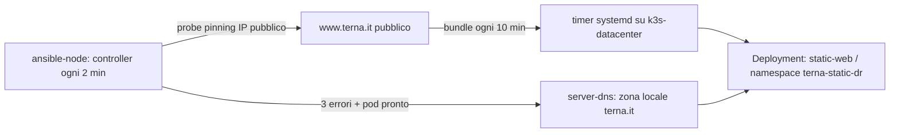

# Terna Static DR — LXC Lab

PoC di disaster recovery per `www.terna.it`, isolata da Helios. Il fallback vive nel namespace Kubernetes `terna-static-dr` su `k3s-datacenter`; il controller vive dentro `ansible-node`.

## DNS del lab

`server-dns` resta ricorsivo. Finché non esiste la zona BIND locale `terna.it`, i nodi LXC risolvono il sito pubblico; il controller crea quella zona solo dopo la soglia di errori, pubblicando `terna.it` e `www.terna.it` con l'IP `10.10.3.10` dell'Ingress Traefik. La rimozione della zona ripristina la risoluzione pubblica. Non viene modificato DNS pubblico di Terna.



La copia è informativa e point-in-time. Il fetcher salva l'HTML della homepage
e le dipendenze first-party necessarie al rendering (CSS, JavaScript, immagini,
font e JSON dichiarati dalla pagina), senza clonare tutte le destinazioni dei
link. Autenticazione, form, API live e pagine interne non catturate non sono
coperte. Usare la PoC nel rispetto delle autorizzazioni e delle policy del sito
sorgente.

Il riquadro Power BI della homepage viene sostituito nel bundle con uno
**screenshot PNG** del grafico del fabbisogno nazionale presente sul sito
primario. Lo screenshot viene pubblicato solo se supera i controlli di
completezza; durante il DR resta congelato all'ultima acquisizione valida.
L'acquisitore usa una porta DevTools effimera, attende l'evento semantico
`rendered` emesso dal client Power BI e prova fino a tre sessioni Chrome
isolate. Ogni PNG viene verificato per struttura, checksum, dimensioni e peso
prima della pubblicazione atomica. Un errore transitorio non sostituisce mai
l'ultimo grafico valido. Su Linux il solo processo che interpreta i contenuti
remoti viene inoltre avviato come utente non privilegiato `nobody`, mentre il
processo coordinatore conserva soltanto i permessi necessari alla pubblicazione.

## Deploy

Da WSL, lanciando `lxc-lab/setup.sh` il Deployment, il timer di acquisizione e
il controller vengono riconciliati automaticamente. Il reconcile importa in
containerd la sola immagine Nginx se non è già presente. Il comando seguente
resta utile solo per un deploy manuale mirato:

```bash
cd /path/to/repository
bash automazione/terna-static-dr/bin/deploy-static-pod.sh
```

Il reconcile Terna può essere rilanciato direttamente anche dopo un riavvio di
LXD/WSL: avvia i container indispensabili, verifica entrambi i resolver del lab
e ripara con retry la WAN DHCP e i servizi DNS. Se il marker `dr-active` è
presente non riattiva la WAN. Se l'origin resta irraggiungibile, continua a
servire l'ultimo bundle valido; il primo bootstrap senza alcun bundle resta
invece bloccante.

Il timer `terna-static-origin-fetch.timer` gira sul nodo `k3s-datacenter` ogni
10 minuti. Risolve l'origin tramite il resolver WAN di `router-edge`
(`10.10.4.2`), con fallback controllato su `server-dns`, scarica la homepage
pubblica con quell'IP fissato e costruisce un bundle locale di tutte le risorse
rilevate e lo valida prima di sostituire
atomicamente il link `current`. Nginx continua quindi a servire l'ultimo bundle
valido se un aggiornamento fallisce. HTML inferiori a 100 KB, bundle con meno
di 3 stylesheet o meno di 10 asset e acquisizioni prive dell'identità Terna
vengono rifiutati. Quando il DNS locale è in DR, il controller crea
`dr-active` e il timer non aggiorna il bundle, evitando che la copia acquisisca
sé stessa. Un reconcile esplicito può migrare atomicamente un vecchio snapshot
anche durante il DR: non rimuove la zona DNS e mantiene `current` invariato se
WAN, DNS, download o validazione falliscono. Un lock impedisce refresh
concorrenti. Verifica:

```bash
lxc exec k3s-datacenter -- kubectl -n terna-static-dr get deployment,pods
lxc exec k3s-datacenter -- systemctl status terna-static-origin-fetch.timer --no-pager
lxc exec k3s-datacenter -- test -s /srv/terna-static-dr/static/current/index.html
lxc exec k3s-datacenter -- test -s /srv/terna-static-dr/static/current/manifest.json
lxc exec k3s-datacenter -- test -f /srv/terna-static-dr/static/current/.bundle-v1
lxc exec k3s-datacenter -- test -s /srv/terna-static-dr/static/current/dr/load-chart/index.html
lxc exec k3s-datacenter -- sh -ec 'chart=/srv/terna-static-dr/static/current/dr/load-chart; test -f "$chart/.load-chart-v1" || test -f "$chart/.load-chart-placeholder-v1"'
curl -H 'Host: terna.it' http://10.10.3.10/dr/load-chart/index.html
curl -H 'Host: terna.it' http://10.10.3.10/health
```

Se il browser o il grafico primario non sono disponibili, viene pubblicato un
placeholder locale esplicito. Il placeholder è un componente DR
valido: lo snapshot, il pod e il failover DNS non vengono bloccati. Restano
bloccanti gli errori nella copia del sito o nella scrittura del bundle locale.

Per verificare dal browser dell'host WSL passando per `server-dns`:

```bash
cd /path/to/repository/automazione/lxc-lab
sudo bash host-dns.sh enable
dig terna.it A +short
dig www.terna.it A +short
curl -I http://www.terna.it/health
```

In modalita primary `dig www.terna.it` deve restituire un IP pubblico. Dopo il
failover `dig terna.it` e `dig www.terna.it` devono restituire `10.10.3.10`; a
quel punto apri `http://www.terna.it/it`. Usa HTTP nel drill: la PoC non possiede
il certificato pubblico di Terna per terminare HTTPS nel lab.

## Health check e drill di failover

Nel file `config.lxc-lab.env` sono configurabili due URL:

```ini
TERNA_PRIMARY_PROBE_URL=https://www.terna.it/
TERNA_STATIC_HEALTH_URL=http://terna.it/health
```

Il primo viene risolto da `TERNA_PUBLIC_DNS_RESOLVER` a ogni check. Il valore
predefinito `10.10.4.2` interroga `router-edge`, che usa il resolver ottenuto
dalla WAN e non segue la zona BIND locale. Il secondo viene raggiunto
direttamente sull'Ingress `10.10.3.10` con `curl --resolve`, prima di scrivere il
DNS: il failover non prosegue se il pod statico non risponde `200` o se manca lo
snapshot.

Per un drill, dopo aver verificato che `current/index.html` esista e aver armato
il controller, interrompi soltanto la WAN simulata:

```bash
lxc exec router-edge -- ifdown wan
```

Con la configurazione predefinita (3 errori ogni 120 secondi), attendi fino a
6 minuti e osserva `journalctl -u terna-static-dr-controller -f` su
`ansible-node`. Verifica poi `dig @10.10.2.53 terna.it` e `curl -H 'Host:
terna.it' http://10.10.3.10/health`. Per ripristinare Internet:

```bash
lxc exec router-edge -- ifup wan
```

Il cutback DNS resta manuale tramite `delete-lab-zone`.

## Controller su ansible-node

```bash
cp automazione/terna-static-dr/config.lxc-lab.env.example automazione/terna-static-dr/config.lxc-lab.env
# Il controller risolve www.terna.it tramite il resolver WAN di router-edge a
# ogni probe: non serve configurare o aggiornare manualmente l'IP pubblico.
# Lascia TERNA_DR_AUTO_FAILOVER_ENABLED=false fino al test del pod.
bash automazione/terna-static-dr/bin/install-on-ansible-node.sh
```

L'installazione copia il progetto in `/opt/terna-static-dr` e installa il servizio `terna-static-dr-controller.service` su `ansible-node`. Dopo aver verificato il probe, abilita esplicitamente il controller:

```bash
# Nel file config.lxc-lab.env: TERNA_DR_AUTO_FAILOVER_ENABLED=true
bash automazione/terna-static-dr/bin/install-on-ansible-node.sh
lxc exec ansible-node -- systemctl status terna-static-dr-controller --no-pager
```

Il cutback è manuale. Per rimuovere la zona locale e tornare al DNS pubblico:

```bash
lxc exec ansible-node -- env TERNA_DR_CONFIG_FILE=/etc/terna-static-dr/config.env \
  bash /opt/terna-static-dr/bin/lxc-lab-controller.sh delete-lab-zone
```

## Test

```bash
bash automazione/terna-static-dr/tests/lxc_lab_contract_test.sh
bash automazione/terna-static-dr/tests/lxc_lab_controller_behavior_test.sh
bash automazione/terna-static-dr/tests/reconcile_lxc_lab_behavior_test.sh
python3 automazione/terna-static-dr/tests/static_bundle_builder_test.py
python3 automazione/terna-static-dr/tests/load_chart_capture_test.py
python3 automazione/terna-static-dr/tests/chrome_devtools_capture_test.py
python3 automazione/terna-static-dr/tests/load_screenshot_publisher_test.py
```
