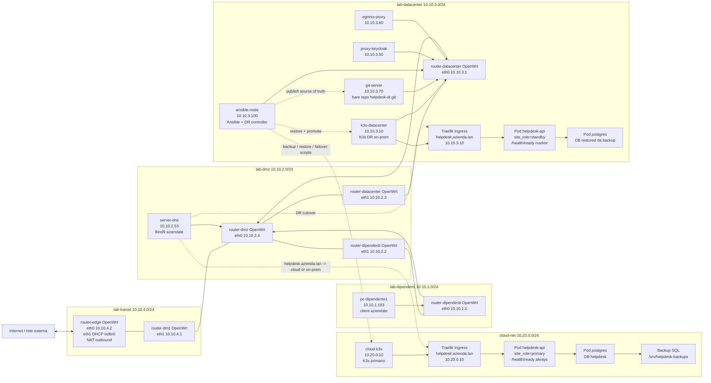
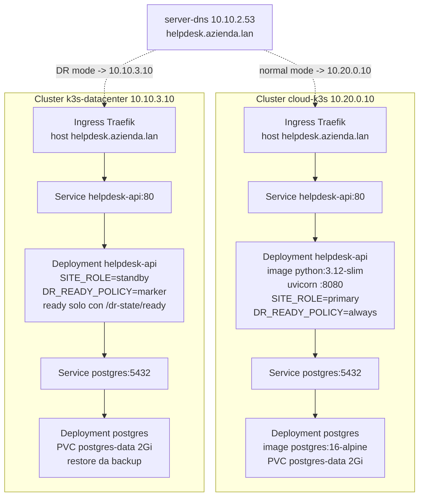
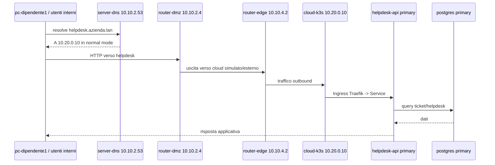
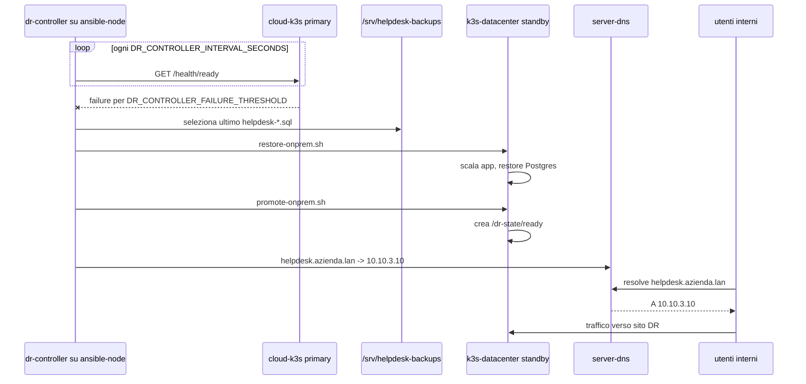

# Topologia progetto Reverse DR

Questo documento descrive la topologia LXC/Kubernetes della PoC: rete on-premise, cloud simulato, servizi applicativi, DNS, Git, backup e flusso di disaster recovery.

## Vista completa

## Reti

| Rete LXD | Subnet | Gateway LXD | Gateway logico | Significato |
|---|---:|---:|---:|---|
| `lab-dipendenti` | `10.10.1.0/24` | `10.10.1.254` | `router-dipendenti 10.10.1.1` | LAN utenti/dipendenti |
| `lab-dmz` | `10.10.2.0/24` | `10.10.2.254` | `router-dmz 10.10.2.4` | DMZ aziendale |
| `lab-datacenter` | `10.10.3.0/24` | `10.10.3.254` | `router-datacenter 10.10.3.1` | Datacenter on-prem |
| `lab-transit` | `10.10.4.0/24` | `10.10.4.254` | `router-edge 10.10.4.2` | Rete transit verso edge |
| `cloud-net` | `10.20.0.0/24` | `10.20.0.1` | `cloud-k3s 10.20.0.10` | Cloud simulato esterno all'on-prem |
| `lxdbr0` | DHCP LXD | variabile | `router-edge eth1` | Uscita NAT verso Internet/host |

## Nodi LXC

| Nodo | OS / ruolo | Interfacce e IP | Servizi principali |
|---|---|---|---|
| `router-dipendenti` | OpenWrt router | `eth0 10.10.1.1`, `eth1 10.10.2.2` | routing LAN dipendenti verso DMZ/DC/edge |
| `router-datacenter` | OpenWrt router | `eth0 10.10.3.1`, `eth1 10.10.2.3` | routing datacenter verso DMZ/edge |
| `router-dmz` | OpenWrt router | `eth0 10.10.2.4`, `eth1 10.10.4.1` | router centrale DMZ, default route verso edge |
| `router-edge` | OpenWrt edge router | `eth0 10.10.4.2`, `eth1 DHCP lxdbr0` | NAT outbound verso Internet, nessun inbound intenzionale |
| `server-dns` | Ubuntu | `eth0 10.10.2.53` | Bind9, zona `azienda.lan`, record `helpdesk.azienda.lan` |
| `pc-dipendente1` | Ubuntu client | `eth0 10.10.1.193` | client interno |
| `k3s-datacenter` | Ubuntu + k3s | `eth0 10.10.3.10` | cluster Kubernetes on-prem DR |
| `proxy-keycloak` | Ubuntu | `eth0 10.10.3.50` | nodo previsto per proxy/autenticazione |
| `egress-proxy` | Ubuntu | `eth0 10.10.3.60` | nodo previsto per egress applicativo |
| `git-server` | Ubuntu | `eth0 10.10.3.70` | repository bare `helpdesk-dr.git`, `git-daemon` |
| `ansible-node` | Ubuntu | `eth0 10.10.3.100` | Ansible, runbook DR, controller DR |
| `cloud-k3s` | Ubuntu + k3s | `eth0 10.20.0.10` | cluster Kubernetes primario cloud simulato |

## Servizi applicativi

## Flusso normale

## Flusso DR automatico

## DNS

| Record | Valore in normal mode | Valore in DR mode | Note |
|---|---:|---:|---|
| `helpdesk.azienda.lan` | `10.20.0.10` | `10.10.3.10` | record aggiornato dagli script DR |
| `server-dns.azienda.lan` | `10.10.2.53` | `10.10.2.53` | DNS aziendale |
| `git-server.azienda.lan` | `10.10.3.70` | `10.10.3.70` | source of truth applicativo |
| `cloud-helpdesk.azienda.lan` | `10.20.0.10` | `10.20.0.10` | riferimento esplicito al primario |
| `onprem-helpdesk.azienda.lan` | `10.10.3.10` | `10.10.3.10` | riferimento esplicito al sito DR |

## Routing logico

| Origine | Default gateway | Rotte rilevanti |
|---|---:|---|
| LAN dipendenti `10.10.1.0/24` | `10.10.1.1` | verso DC via DMZ, default verso `10.10.2.4` |
| Datacenter `10.10.3.0/24` | `10.10.3.1` | verso dipendenti via `10.10.2.2`, default verso `10.10.2.4` |
| DMZ `10.10.2.0/24` | `10.10.2.4` | route verso dipendenti `10.10.2.2`, DC `10.10.2.3`, transit `10.10.4.2` |
| Transit `10.10.4.0/24` | `10.10.4.2` | uscita tramite `router-edge` |
| Cloud simulato `10.20.0.0/24` | `10.20.0.1` | rete LXD separata dall'on-prem |

## Componenti DR

| Componente | Dove gira | Responsabilita |
|---|---|---|
| `backup-cloud.sh` | host WSL / ansible-node operativo | genera backup SQL da Postgres cloud |
| `cloud-local-backup.sh` | `cloud-k3s` via timer | backup periodico locale nel cloud simulato |
| `restore-onprem.sh` | host WSL / ansible-node operativo | copia ultimo backup e ripristina Postgres on-prem |
| `promote-onprem.sh` | host WSL / ansible-node operativo | scala app on-prem, crea marker `/dr-state/ready`, aggiorna DNS |
| `demote-onprem.sh` | host WSL / ansible-node operativo | rimuove marker DR e riporta on-prem in standby |
| `dr-controller.sh` | host WSL / ansible-node operativo | monitora primary e attiva failover automatico |
| K8GB manifest | entrambi i cluster, futuro step | GSLB DNS failover basato su readiness |

## Scelta architetturale

La PoC separa tre responsabilita:

1. DNS/GSLB: `server-dns` oggi, K8GB in uno step successivo.
2. Orchestrazione DR: `dr-controller.sh` e runbook Ansible/script.
3. Stato applicativo: backup/restore Postgres, non replica active-active.

Questa separazione e intenzionale: K8GB decide quale sito pubblicare, ma non deve eseguire restore o playbook. La readiness on-prem diventa positiva solo dopo restore e promozione, quindi il traffico non viene mandato a un sito DR non pronto.

