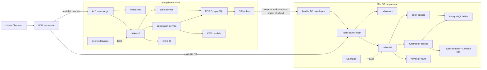
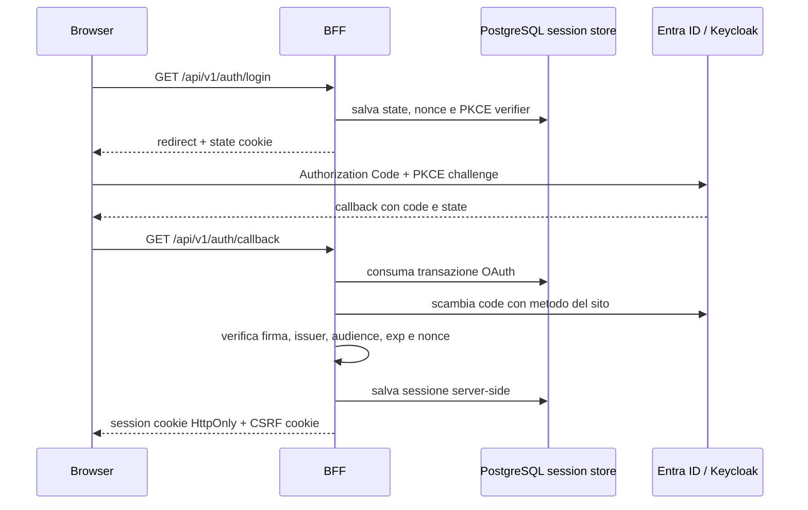
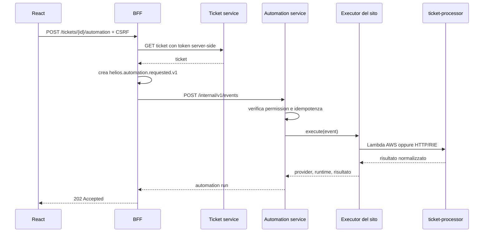
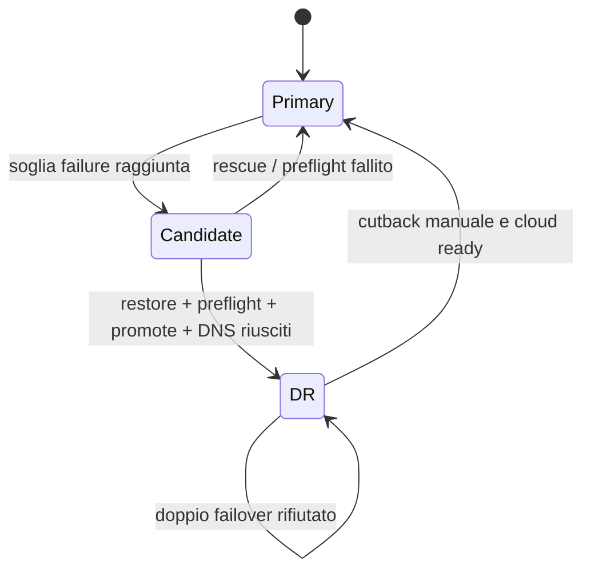
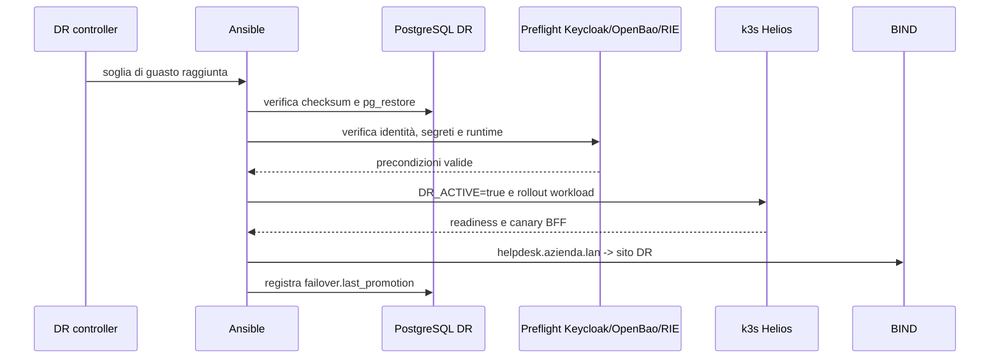

# Progettazione e validazione di una Proof of Concept per il Reverse Disaster Recovery sovrano

## Nota sul perimetro del documento

Questo documento descrive la Proof of Concept (POC) contenuta nel repository, ricostruendone motivazioni, architettura, implementazione, procedura di failover e strategia di validazione. Il testo distingue deliberatamente tre livelli:

- **architettura target**, cioè il sistema cloud AWS con sito di Disaster Recovery on-premise;
- **implementazione disponibile nel repository**, costituita da codice applicativo, Infrastructure as Code, manifest Kubernetes, script, contratti e runbook;
- **laboratorio dimostrativo**, basato su WSL2, LXD e k3s, nel quale il nodo `cloud-k3s` rappresenta un dominio di guasto controllabile ma non ospita più il primario applicativo.

Questa distinzione è necessaria perché nel repository convivono artefatti di due generazioni. La generazione corrente è la piattaforma **Helios Desk**, composta da frontend React, BFF e servizi FastAPI, con primario su AWS EKS e sito di recovery on-premise. La parte storica in `automazione/helpdesk-dr` e `automazione/lxc-lab` non rappresenta più una seconda applicazione: conserva la rete di laboratorio, PostgreSQL, il coordinatore Ansible e gli script di Disaster Recovery ancora utilizzati dalla soluzione corrente. Il precedente monolite `helpdesk-api` e la simulazione LocalStack sono stati rimossi.

I riferimenti presenti nel testo rimandano agli artefatti del repository e hanno lo scopo di rendere ogni affermazione tecnica verificabile. Non sono invece incluse fonti bibliografiche esterne, che dovranno essere integrate nella versione editoriale definitiva della tesi.

---

# Capitolo 1 — Contesto, problema e obiettivi

## 1.1 Continuità digitale e sistemi cyber-fisici

La trasformazione delle reti elettriche in Smart Grid rende il software una componente operativa del sistema fisico. Monitoraggio distribuito, automazione, previsione, controllo remoto e integrazione di fonti rinnovabili aumentano la capacità di governare una rete dinamica, ma introducono anche nuove dipendenze. La disponibilità dell'infrastruttura digitale non è più soltanto una proprietà del sistema informativo: condiziona la capacità dell'organizzazione di osservare e controllare processi reali.

In questo scenario il cloud pubblico offre elasticità, servizi gestiti e rapidità di provisioning. Allo stesso tempo concentra dipendenze tecniche e organizzative in un insieme di control plane, sistemi di identità, API proprietarie e vincoli giurisdizionali. Un'interruzione estesa può quindi derivare non soltanto dal guasto di una macchina o di una zona, ma anche dall'irraggiungibilità del provider, da una compromissione della supply chain, da una segmentazione della connettività o da restrizioni che impediscono l'accesso ai servizi gestiti.

La POC parte da questa osservazione: una strategia di continuità basata esclusivamente sulle funzionalità del medesimo cloud non copre il caso in cui il provider o il suo control plane diventino parte del dominio di guasto. Il problema non è eliminare il cloud, ma evitare che la capacità di ripristino dipenda esclusivamente dall'ambiente che si intende sostituire durante la crisi.

## 1.2 Business Continuity, High Availability e Disaster Recovery

La Business Continuity comprende l'insieme delle capacità organizzative e tecnologiche necessarie a mantenere o ripristinare i processi critici. High Availability e Disaster Recovery affrontano porzioni diverse del problema.

La High Availability riduce l'impatto di guasti locali mediante ridondanza, replica e failover rapido fra componenti attivi. Il Disaster Recovery interviene invece quando l'ambiente primario non è più utilizzabile e richiede il ripristino del servizio in un sito differente. I due indicatori classici sono:

- **Recovery Time Objective (RTO)**: durata massima tollerabile dell'interruzione prima del ripristino del servizio;
- **Recovery Point Objective (RPO)**: quantità massima di dati che può essere persa, espressa come distanza temporale dall'ultimo stato recuperabile.

Nella POC questi valori non sono trattati come semplici parametri dichiarativi. L'obiettivo è separato dalla misura: i target sono configurabili, mentre RPO e RTO osservati vengono scritti dai componenti che eseguono realmente backup e failover. Se una misura non esiste, la piattaforma restituisce `unknown` e l'interfaccia mostra “Mai misurato”. Questa scelta evita di presentare come evidenza un valore preconfigurato.

## 1.3 Definizione di Reverse Disaster Recovery

Nel Disaster Recovery convenzionale il sito secondario è spesso un'altra regione o un altro servizio cloud. Nel **Reverse Disaster Recovery** adottato dalla POC la direzione è opposta: il primario è nel cloud pubblico, mentre il target di recovery è un ambiente sotto il controllo diretto dell'organizzazione, on-premise o comunque sovrano rispetto al provider primario.

L'obiettivo non è replicare nel sito di emergenza tutte le caratteristiche del cloud, ma preservare un sottoinsieme operativo essenziale:

- accesso degli utenti autorizzati;
- consultazione e gestione dei ticket;
- esecuzione della funzione di automazione associata ai ticket;
- disponibilità di rete, DNS, identità, segreti e database senza dipendenze dal control plane cloud;
- visibilità dello stato del sito e delle misure di recovery.

Questa impostazione introduce un'asimmetria deliberata. Il primario può utilizzare servizi gestiti AWS; il sito DR usa Kubernetes leggero, database self-hosted, Keycloak e OpenBao. La portabilità non coincide quindi con l'identità dell'infrastruttura, ma con la stabilità del **contratto applicativo** e con la possibilità di sostituire i provider mediante configurazione di deployment.

## 1.4 Domanda di ricerca

La domanda alla quale la POC intende rispondere può essere formulata nel modo seguente:

> È possibile mantenere operativo un servizio applicativo cloud-native in un sito on-premise autonomo, quando il cloud primario non è disponibile, preservando API, regole di dominio e funzione di automazione, ma sostituendo in modo controllato i provider di identità, segreti ed esecuzione serverless?

La risposta viene esplorata attraverso quattro invarianti:

1. **invariante applicativo**: gli stessi quattro workload Helios e lo stesso path pubblico `/api/v1` sono utilizzati nei due siti;
2. **invariante di autorizzazione**: i due identity provider emettono lo stesso insieme logico di ruoli e lo stesso claim di autorizzazione;
3. **invariante dei segreti**: i Deployment consumano gli stessi Secret Kubernetes, indipendentemente dal backend che li materializza;
4. **invariante di automazione**: lo stesso handler `helpdesk-ticket-processor` produce lo stesso risultato business sia su AWS Lambda sia su Lambda Runtime Interface Emulator nel cluster on-premise.

## 1.5 Obiettivi e non-obiettivi

Gli obiettivi della POC sono:

- rappresentare un primario production-like su AWS mediante Terraform, manifest Kubernetes e un runbook di provisioning;
- realizzare un'applicazione modulare che non incorpori branch business specifici per il sito;
- preparare un sito DR in cold standby per i workload e warm standby per identità e segreti;
- automatizzare detection, restore, preflight, promozione, canary e cambio DNS;
- misurare il tempo dell'orchestrazione di failover e l'età dell'ultimo backup valido;
- esplicitare i limiti sperimentali e impedire che una configurazione incompleta venga interpretata come successo.

Non sono obiettivi della versione corrente:

- dimostrare High Availability multi-AZ del primario, volutamente single-AZ per contenere il costo;
- garantire RPO prossimo allo zero mediante replica WAL o replica logica;
- automatizzare il cutback verso il cloud;
- riprodurre in laboratorio l'intero control plane AWS;
- implementare una federazione completa dell'identità aziendale nel sito DR;
- attestare una configurazione pronta per la produzione.

---

# Capitolo 2 — Progettazione e implementazione della soluzione

## 2.1 Obiettivi, requisiti e modello di guasto

### 2.1.1 Obiettivo della POC

La POC progetta un percorso di **Reverse Disaster Recovery dal cloud verso un datacenter on-premise**. Il primario sfrutta servizi gestiti AWS, mentre il sito di emergenza mantiene una capacità operativa autonoma e controllata dall'organizzazione.

L'obiettivo applicativo è garantire continuità senza modificare il codice business durante il passaggio di sito. Frontend, BFF, servizi di dominio e handler di automazione restano invariati; identità, secret manager e runtime serverless vengono sostituiti mediante configurazione di deployment. L'autonomia richiesta non riguarda quindi soltanto compute e database: il DR deve possedere localmente DNS, orchestrazione, identità, segreti, sorgente dello stato desiderato e capacità di eseguire l'automazione.

### 2.1.2 Modello di guasto

Il modello di guasto considera indisponibile il dominio cloud primario e assume ancora operativo il datacenter on-premise. La POC non si limita al riavvio dei pod: considera indisponibili o non affidabili anche servizi che normalmente risiedono nel cloud, tra cui identity provider, secret manager e runtime serverless.

Il sito DR deve quindi possedere localmente:

- orchestrazione Kubernetes;
- identità utilizzabile senza Entra ID;
- una fonte dei segreti non dipendente da AWS;
- una copia ripristinabile dei dati;
- un runtime compatibile con la funzione Lambda;
- DNS autorevole e coordinatore del failover;
- repository Git off-cloud contenente lo stato desiderato e i runbook.

L'ipotesi più forte è che l'artefatto di backup sia già arrivato nel mirror on-premise. Il laboratorio non implementa il trasporto automatico dal bucket S3 al mirror e usa un dump stand-in creato manualmente. Tale limite è rilevante perché la disponibilità di compute e manifest non è sufficiente se manca lo stato applicativo recuperabile.

### 2.1.3 Requisiti funzionali

La POC deve consentire a un operatore di:

1. autenticarsi sul provider disponibile nel sito attivo;
2. visualizzare la sessione e il sito corrente;
3. creare, leggere, modificare e cancellare ticket;
4. filtrare i ticket e consultarne il dettaglio;
5. avviare l'automazione di triage di un ticket;
6. osservare provider e runtime che hanno eseguito l'automazione;
7. consultare lo stato dei servizi e le metriche DR;
8. eseguire un failover senza modificare il codice applicativo.

Il contratto di deployment in [`automazione/contracts/deployment-contract.json`](automazione/contracts/deployment-contract.json) formalizza i nomi, le porte, i path di health, i ruoli, i runtime e i provider per sito. Esso riduce il rischio che Terraform, manifest, codice e Ansible evolvano in direzioni incompatibili.

### 2.1.4 Requisiti non funzionali

I requisiti non funzionali principali sono:

- **portabilità**: container e Kubernetes costituiscono l'unità comune di esecuzione;
- **isolamento**: namespace separati, servizi interni `ClusterIP` e NetworkPolicy default-deny;
- **sicurezza browser**: sessione in cookie `HttpOnly`, nessun token in Web Storage, same-origin e protezione CSRF;
- **validazione fail-closed**: input, token, issuer, audience e ruoli devono essere verificati a ogni confine;
- **immutabilità del dominio**: gli oggetti applicativi vengono ricostruiti, non modificati in-place;
- **idempotenza**: automazioni duplicate sullo stesso evento non devono produrre esecuzioni multiple;
- **osservabilità onesta**: assenza di misura e indisponibilità dei componenti non vengono convertite in valori di successo;
- **riproducibilità**: infrastruttura, manifest e procedure sono versionati e verificabili staticamente.

### 2.1.5 Principi architetturali

La decisione architetturale centrale consiste nel separare il contratto consumato dal servizio dal provider che lo implementa. Questo approccio evita condizioni come `if site == "dr"` nel dominio. Il sito viene scelto da variabili e manifest, ad esempio `OIDC_CLIENT_AUTH_METHOD` e `AUTOMATION_MODE`; l'applicazione dipende da porte astratte e gli adapter concreti vengono costruiti nei composition root dei servizi.

Gli altri principi derivano direttamente dai requisiti non funzionali:

- **portabilità**, ottenuta con container, Kubernetes e contratti applicativi stabili;
- **fail-closed**, per impedire promozioni, autenticazioni o richieste quando le precondizioni non sono verificabili;
- **isolamento**, mediante namespace, servizi interni e NetworkPolicy default-deny;
- **immutabilità**, applicata ai modelli di dominio e agli eventi;
- **idempotenza**, per evitare doppie esecuzioni e promozioni duplicate;
- **osservabilità**, basata su misure prodotte dai componenti che svolgono le operazioni;
- **riproducibilità**, tramite Infrastructure as Code, manifest, contratti e runbook versionati.

---

## 2.2 Architettura complessiva

### 2.2.1 Vista end-to-end

L'architettura corrente è composta da un sito primario AWS, un sito DR on-premise e un laboratorio LXC che riproduce rete e domini di controllo.



La figura mette in evidenza che il frontend, il BFF e i servizi rimangono gli stessi; cambiano i componenti di piattaforma attorno a essi. Il sito DR non è una semplice copia statica: possiede identity plane, secret plane, runtime di automazione e coordinamento autonomi.

### 2.2.2 Sito primario AWS

Lo stack dichiarativo in [`automazione/infra/aws`](automazione/infra/aws) compone sette moduli Terraform: rete, ECR, EKS, database, storage/edge, automazione e workload identity.

#### Infrastruttura: rete e scelta single-AZ

Il primario è intenzionalmente cost-conscious e non High Availability. Nodi EKS, pod, NAT e RDS risiedono in una sola Availability Zone primaria. Una seconda AZ, definita **witness**, è presente perché EKS e Application Load Balancer richiedono subnet distribuite su almeno due zone. La witness ospita soltanto le interfacce necessarie al control plane, all'ALB e al DB subnet group; i workload sono esplicitamente proibiti.

Questa scelta evita di presentare una POC economica come architettura HA. Il managed node group riceve soltanto la subnet privata primaria; RDS ha `multi_az = false` e un'Availability Zone fissata. La seconda zona soddisfa i vincoli della piattaforma, non fornisce ridondanza applicativa.

Per l'egress viene utilizzata una NAT instance ARM `t4g.nano` al posto di un NAT Gateway. È una scelta di costo con un limite evidente: la NAT instance è un ulteriore single point of failure del primario. L'endpoint EKS è privato per default e gli eventuali CIDR pubblici sono soggetti a validazione, con rifiuto delle reti world-open.

#### Infrastruttura: compute, registry e ingresso

EKS ospita i quattro workload applicativi:

- `helios-web` sulla porta 8080;
- `helios-bff` sulla porta 8000;
- `helios-ticket-service` sulla porta 8001;
- `helios-automation-service` sulla porta 8002.

I repository ECR sono immutabili e configurati per la scansione al push. È presente un quinto repository per l'immagine della function, che non costituisce un microservizio aggiuntivo.

L'endpoint canonico è l'ALB creato dal controller Kubernetes. Il routing mantiene frontend e BFF sullo stesso host HTTPS: `/api/*` viene inoltrato al BFF, mentre `/` raggiunge React. Questa topologia è necessaria per i cookie con prefisso `__Host-`, la callback OIDC e la strategia CSRF. La distribuzione CloudFront è opzionale e disabilitata per default; serve soltanto come preview statica e non è l'endpoint dell'applicazione autenticata.

#### Persistenza ed eventi

Il database primario è RDS PostgreSQL single-AZ. Le tabelle applicative comprendono ticket, sessioni BFF, run di automazione, outbox e telemetria DR. EventBridge, SQS e DLQ modellano il piano eventi; la Lambda viene creata solo quando è fornito l'URI dell'immagine ECR.

#### Backup

Un CronJob Kubernetes esegue ogni dieci minuti un `pg_dump` in formato custom compresso, calcola SHA-256, carica dump e checksum in S3 e solo dopo l'upload riuscito registra `backup.last_success` nella tabella `dr_telemetry`. Il dump logico non sostituisce gli automated backup RDS: è l'artefatto portabile necessario al restore on-premise.

#### Identità e segreti

L'accesso ai servizi AWS segue il principio del minimo privilegio tramite ruoli IRSA distinti per BFF, ticket service, automation service e job di backup. Terraform crea i contenitori Secrets Manager ma non versiona i valori applicativi. External Secrets Operator materializza nel cluster Secret Kubernetes separati, in modo che i pod non ricevano access key statiche.

Le application registration Entra ID non sono create dal repository: sono un input amministrato dal team identità. Di conseguenza audience, issuer, token endpoint e certificato del client BFF devono essere forniti dall'esterno. Sul primario il BFF usa `private_key_jwt`, coerentemente con una policy che vieta client secret per l'applicazione aziendale.

### 2.2.3 Sito di Disaster Recovery

#### Kubernetes e cold standby

Il sito DR viene aggiunto a un cluster k3s esistente mediante i manifest in [`automazione/infra/onprem`](automazione/infra/onprem). È suddiviso in due namespace:

- `helios-desk`, che contiene i quattro workload applicativi;
- `helios-identity`, che contiene Keycloak e il relativo PostgreSQL.

I workload Helios hanno zero repliche a riposo. Il sito è quindi un **cold standby applicativo**: immagini, manifest, database e dipendenze sono predisposti, ma il compute applicativo viene scalato durante la promozione. Keycloak e il suo database rimangono invece a una replica, perché il login e il discovery OIDC devono essere verificabili prima del cambio DNS.

#### Identità

Il database Keycloak è separato dal database applicativo. Il restore del database `helios` non può quindi cancellare realm, client, ruoli o credenziali DR. Il repository conserva inoltre un PostgreSQL originato dalla generazione di laboratorio precedente, nel namespace `helpdesk`, ma l'applicazione corrente usa obbligatoriamente il database dedicato `helios`: il database legacy `helpdesk` presenta uno schema incompatibile e gli script lo rifiutano esplicitamente.

Keycloak mantiene warm il realm `helios-desk`, il client BFF e i ruoli `tickets.read`, `tickets.write` e `automation.execute`. Un job idempotente crea o riconcilia l'operatore locale necessario alla POC, così il login DR non dipende dalla disponibilità di Entra ID.

#### Segreti

OpenBao risiede su un nodo dedicato fuori da k3s e usa il sigillo Shamir. External Secrets Operator legge i percorsi autorizzati e materializza gli stessi Secret Kubernetes consumati sul primario. L'auto-unseal locale è disponibile soltanto come opzione esplicita e conserva il compromesso, dichiarato, di collocare chiave e storage nello stesso failure domain.

#### Runtime di automazione

Il sito DR sostituisce AWS Lambda con Lambda Runtime Interface Emulator. L'automation service invia l'evento all'Event Adapter, che costruisce l'envelope API Gateway e inoltra la richiesta al pod della function senza modificare l'handler applicativo.

#### Sicurezza e ingresso

Traefik riproduce il routing same-origin del primario. Le NetworkPolicy adottano default-deny e aprono soltanto i flussi richiesti: ingresso verso web, BFF e Keycloak; comunicazioni BFF-servizi; accesso dei servizi al database; accesso dell'automation service all'event adapter; DNS e migrazioni.

### 2.2.4 Laboratorio sperimentale

Il laboratorio usa Windows con WSL2 e LXD. Le reti sono segmentate per simulare una piccola infrastruttura aziendale:

| Rete | Subnet | Scopo |
|---|---:|---|
| `lab-dipendenti` | `10.10.1.0/24` | LAN degli utenti |
| `lab-dmz` | `10.10.2.0/24` | DMZ e DNS aziendale |
| `lab-datacenter` | `10.10.3.0/24` | cluster DR e servizi sovrani |
| `lab-transit` | `10.10.4.0/24` | transito verso l'edge |
| `cloud-net` | `10.20.0.0/24` | dominio cloud simulato |

I router OpenWrt separano LAN, datacenter, DMZ e transito. `router-edge` fornisce soltanto NAT outbound tramite `lxdbr0`; non è previsto inbound da Internet. I nodi principali sono:

- `k3s-datacenter`, cluster on-premise;
- `server-dns`, autorità BIND per `azienda.lan`;
- `ansible-node`, coordinatore DR;
- `git-server`, repository bare off-cloud;
- `vault-openbao`, secret manager del sito DR;
- `proxy-keycloak`, nodo previsto nella topologia identità;
- `pc-dipendente1`, client interno;
- `cloud-k3s`, data plane spegnibile utilizzato come failure domain del drill.

Il diagramma [`architettura-cloud-sovrana.drawio`](architettura-cloud-sovrana.drawio) rappresenta correttamente il principio cloud-to-on-prem, ma è deliberatamente generico: menziona famiglie tecnologiche alternative e non va interpretato come inventario esatto dell'implementazione corrente.

### 2.2.5 Contratti di portabilità

La portabilità viene realizzata mantenendo stabile il contratto consumato dall'applicazione e sostituendo il provider nel deployment.

| Piano | Primario AWS | Sito DR on-premise | Contratto stabile |
|---|---|---|---|
| Identity | Entra ID | Keycloak | issuer configurato, audience, claim `roles`, permessi applicativi |
| Secrets | AWS Secrets Manager | OpenBao | Secret Kubernetes prodotti da External Secrets Operator |
| Automation | AWS Lambda | Lambda RIE su k3s | stesso handler e stesso risultato business |

#### Piano di identità

Il primario usa Entra ID, mentre il sito DR usa Keycloak. I provider hanno issuer diversi e le sessioni non vengono riutilizzate dopo il failover. Il contratto condiviso comprende:

- claim autorizzazioni `roles`;
- permessi `tickets.read`, `tickets.write`, `automation.execute`;
- audience logica coerente fra i due ambienti;
- identificativo aziendale stabile `employee_id`.

Sul sito DR il realm Keycloak viene importato all'avvio solo se non esiste. Il client `helios-bff` usa Authorization Code con PKCE S256, è confidential e non abilita implicit flow, password grant o service account. Uno script idempotente crea o riconcilia un operatore DR locale e gli assegna i tre ruoli.

La presenza di un singolo operatore locale è sufficiente per la dimostrazione, non per la produzione. Un broker verso Entra non garantirebbe autonomia durante l'interruzione del cloud; per un sistema reale servirebbe una sorgente identità locale, ad esempio LDAP o Active Directory on-premise, realmente disponibile durante il disastro.

#### Piano dei segreti

Sul primario i segreti provengono da AWS Secrets Manager e vengono letti tramite IRSA; nel DR provengono da OpenBao e vengono letti da External Secrets Operator tramite ServiceAccount Kubernetes. In entrambi i casi i Deployment montano Secret con nomi invarianti.

OpenBao è collocato su un nodo LXC dedicato, esterno a k3s. Questa separazione impedisce che la ricostruzione del cluster elimini anche il materiale crittografico che serve a ricostruirlo. Il sigillo è Shamir. Il failover esegue un preflight esplicito e rifiuta la promozione se il vault è sigillato o irraggiungibile.

È disponibile un auto-unseal locale, ma solo come opzione esplicita. Le chiavi vengono conservate sullo stesso filesystem dello storage cifrato: ciò consente il riavvio non presidiato, ma riduce la protezione contro il furto del disco. Il compromesso è accettabile come oggetto di studio, non come modello definitivo. In produzione l'autorità di unseal dovrebbe risiedere nel sito DR ma fuori dal nodo protetto, tramite HSM locale o transit unseal.

#### Piano di automazione

L'automazione `helpdesk-ticket-processor` dimostra la portabilità del comportamento, non soltanto del container. Sul primario l'automation service usa `boto3 Invoke` verso AWS Lambda; nel DR effettua una richiesta HTTP all'event adapter, che converte il payload in un evento API Gateway proxy e invoca un runtime RIE.

L'handler è la sorgente unica. Poiché Kustomize non può generare un ConfigMap da un file esterno alla propria root, il manifest DR contiene una copia controllata del sorgente. Lo script `sync-onprem-configmap.py` la aggiorna e il deployment contract fallisce se le due versioni divergono.

Il risultato applicativo è invariato anche se gli envelope sono diversi: invocazione diretta AWS e percorso proxy DR vengono normalizzati in ingresso e adattati in uscita. La UI mostra `provider` e `runtime`, rendendo osservabile il cambio di piattaforma.

---

## 2.3 Implementazione applicativa

### 2.3.1 Struttura dei servizi

Il backend è realizzato in Python 3.12 con FastAPI ed è suddiviso in tre processi:

- **BFF**, confine fra browser e servizi interni;
- **ticket service**, responsabile del dominio ticket;
- **automation service**, responsabile delle esecuzioni idempotenti.

Ogni servizio segue una struttura ispirata a Clean Architecture:

```text
domain/          modelli e invarianti
application/     casi d'uso e porte
infrastructure/  Postgres, HTTP, OIDC, Lambda
presentation/    API FastAPI e mapping degli errori
main.py          composition root
```

Le dipendenze puntano verso l'interno. I casi d'uso dipendono da `Protocol` astratti; i repository Postgres e gli executor vengono iniettati da `main.py`. Questa separazione rende possibile testare dominio e applicazione senza database o provider reali e consente di sostituire gli adapter per sito.

### 2.3.2 Dominio ticket

Il modello `Ticket` è una dataclass immutabile. Comprende identificativo UUID, titolo, descrizione, priorità, stato, assegnatario, servizio, ambiente, creatore e timestamp timezone-aware. Le transizioni restituiscono una nuova istanza e un ticket chiuso non può essere riaperto.

La validazione è duplicata intenzionalmente ai confini appropriati:

- Pydantic rifiuta richieste malformate o campi extra nell'API;
- il dominio riconvalida lunghezze, timestamp e transizioni;
- PostgreSQL conserva lo stato e l'outbox nello stesso confine transazionale.

Il `TicketApplication` richiede i permessi applicativi, costruisce eventi canonici e delega la persistenza alla porta `TicketRepository`. Gli eventi `helios.ticket.created.v1`, `updated.v1` e `deleted.v1` contengono schema versionato, aggregate, subject e timestamp.

### 2.3.3 Backend for Frontend

Il BFF impedisce che i bearer token vengano consegnati al browser. La UI conosce soltanto un identificatore di sessione opaco in cookie `HttpOnly`; transazioni OAuth, token e sessioni sono conservati server-side in PostgreSQL.

Il flusso di login è:



La credenziale client è un adapter: `private_key_jwt` sul primario e client secret nel DR. Il verifier ammette soltanto algoritmi asimmetrici configurati e valida JWKS, issuer, audience, scadenza e claim dei ruoli.

Il frontend usa esclusivamente path same-origin e `credentials: same-origin`. Logout e invocazione dell'automazione applicano un controllo double-submit CSRF esplicito. Le mutazioni ticket inviano comunque l'header CSRF dal client; il cookie di sessione `SameSite` costituisce un ulteriore confine.

### 2.3.4 CRUD e persistenza

Per una richiesta di creazione ticket:

1. React invia il payload al BFF;
2. il BFF recupera il token dalla sessione server-side;
3. l'`HttpTicketClient` inoltra la richiesta al ticket service;
4. il servizio valida token e permesso `tickets.write`;
5. il caso d'uso costruisce un nuovo oggetto `Ticket`;
6. repository e outbox vengono aggiornati nella stessa transazione;
7. la risposta usa un envelope con `data` e header `Location`.

List, get, patch e delete seguono lo stesso confine. La lista supporta un limite massimo e un cursore opaco. Gli errori applicativi vengono tradotti in envelope stabili e il BFF preserva gli status client noti, trasformando in `502` soltanto errori di trasporto o status non riconosciuti.

Il sistema usa PostgreSQL per:

- transazioni OAuth e sessioni BFF;
- ticket e `ticket_outbox`;
- run di automazione e `automation_outbox`;
- telemetria DR.

Gli oggetti di dominio e i relativi eventi vengono persistiti atomicamente. Nel repository non è tuttavia presente un publisher outbox completo: le tabelle costituiscono la base per una futura consegna asincrona, ma la pubblicazione non è dimostrata nel perimetro corrente. EventBridge e SQS sono predisposti nell'infrastruttura AWS, senza che ciò autorizzi a dichiarare completato un flusso event-driven end-to-end.

### 2.3.5 Automazione portabile

L'automazione parte dal drawer del ticket:



L'`AutomationApplication` cerca prima un run con lo stesso `source_event_id`. Se esiste, lo restituisce; altrimenti crea un run `running`, invoca l'executor e persiste un esito `succeeded` o `failed`. Gli errori vengono trasformati in codici sicuri senza esporre dettagli interni.

La function di triage è pura: classifica il ticket e suggerisce coda/SLA, ma non scrive nel database e non emette eventi. Questa scelta limita il realismo funzionale, ma elimina effetti parziali da riconciliare durante il drill e rende deterministica la comparazione fra runtime.

### 2.3.6 Frontend

Il frontend React 19 e Vite presenta una dashboard orientata alla tabella. Le funzioni implementate comprendono sessione, filtri, dettaglio, creazione, modifica, cancellazione, lancio dell'automazione e visualizzazione delle metriche DR.

La configurazione runtime viene caricata da `/config/runtime-config.json` con cache disabilitata. L'applicazione rifiuta API base assolute per mantenere il confine same-origin e usa il demo adapter soltanto se `demoMode` è esplicitamente abilitato. Nel container di produzione il default è fail-closed.

Le sezioni “Automazioni” e “Audit” della navigazione non corrispondono ancora a servizi completi. Il feed attività restituito dal platform probe è vuoto e costituisce un'area di sviluppo futuro, non una capacità già implementata.

### 2.3.7 Telemetria

La telemetria di Disaster Recovery è conservata nella tabella `dr_telemetry`. Il BFF la espone attraverso `GET /api/v1/platform/status` insieme allo stato dei servizi e il frontend la traduce in indicatori RPO e RTO. Il BFF è un reader: non dichiara il successo di backup o failover e non costruisce misure a partire da variabili statiche.

I writer sono esterni al processo applicativo. Il CronJob AWS registra `backup.last_success` dopo il caricamento riuscito su S3; il playbook Ansible registra `failover.last_promotion` dopo promozione e cambio DNS. Sono configurabili soltanto gli obiettivi `RPO_TARGET_SECONDS` e `RTO_TARGET_SECONDS`. Il dominio classifica le misure come `ok`, `warning`, `critical` o `unknown`, conservando esplicitamente lo stato “mai misurato”.

---

## 2.4 Orchestrazione del Reverse Disaster Recovery

### 2.4.1 Preparazione dello standby

Il runbook [`automazione/RUNBOOK_SCENARIO_REALE.md`](automazione/RUNBOOK_SCENARIO_REALE.md) porta un host Windows/WSL2 da zero a un sito DR predisposto. I passaggi principali sono:

1. creazione delle reti e dei nodi LXC;
2. installazione di k3s sul nodo datacenter;
3. configurazione di certificati e hostname;
4. build e import delle immagini Helios;
5. installazione di External Secrets Operator;
6. installazione, inizializzazione e unseal di OpenBao;
7. caricamento dei segreti fuori da Git;
8. deployment di Keycloak, database e runtime `lambda-dr`;
9. applicazione delle migrazioni al database `helios`;
10. provisioning dell'operatore DR;
11. deploy dei quattro workload a zero repliche;
12. pubblicazione del source of truth su `git-server` e bootstrap di `ansible-node`.

Su WSL2 la MTU dei container viene ridotta a 1200 per evitare timeout TLS e problemi nei pull. È un dettaglio operativo del laboratorio, non una proprietà generale dell'architettura.

### 2.4.2 Git off-cloud e coordinatore

`publish-git-truth.sh` crea sul `git-server` un repository bare contenente Ansible, manifest, script, overlay on-premise, OpenBao e deployment contract. `bootstrap-ansible-control-node.sh` clona tale repository in `/opt/helpdesk-dr` su `ansible-node` e verifica la sintassi del playbook.

Questa scelta mantiene il runbook raggiungibile nel failure domain on-premise. Non è però un sistema GitOps completo: la promozione e lo scaling rimangono responsabilità di Ansible. I manifest K8GB rappresentano una possibile estensione DNS/GSLB, ma non sono applicati dagli script base e non sostituiscono la logica stateful di restore e failover.

### 2.4.3 Rilevamento del guasto

Il `dr-controller.sh` gira su `ansible-node`, acquisisce un lock e sonda `/readyz` dell'API Kubernetes di `cloud-k3s`. I valori di default sono:

- intervallo: 20 secondi;
- soglia di fallimento: 3 sonde consecutive;
- soglia di successo: 2 sonde consecutive.

Il controller non sonda il vecchio endpoint applicativo `/dr-status`, perché il monolite non esiste più. Nel laboratorio il segnale rappresenta la perdita del data plane cloud simulato; non costituisce una verifica dell'indisponibilità di EKS reale.

La macchina a stati operativa è minimale:



Lo stato `primary` è implicito se il file di stato non esiste; `dr` viene scritto soltanto dopo una promozione completata. Un secondo failover mentre il sito è già in DR viene rifiutato.

### 2.4.4 Failover

Il playbook [`automazione/helpdesk-dr/ansible/playbooks/failover.yml`](automazione/helpdesk-dr/ansible/playbooks/failover.yml) esegue una transazione operativa ordinata:

1. verifica che l'esecuzione avvenga sul coordinatore previsto;
2. rifiuta un failover duplicato;
3. avvia il cronometro dell'RTO;
4. seleziona l'ultimo dump dal mirror on-premise;
5. verifica il checksum SHA-256;
6. mantiene i workload Helios fermi e ripristina PostgreSQL con `pg_restore`;
7. verifica `event-adapter` e Lambda RIE;
8. verifica che OpenBao sia raggiungibile e dissigillato;
9. attende PostgreSQL Keycloak, Keycloak e discovery issuer;
10. imposta `DR_ACTIVE=true` e configura il BFF per Keycloak;
11. scala ticket, automation, BFF e web;
12. attende la readiness e invia un canary attraverso il BFF;
13. aggiorna il record BIND `helpdesk.azienda.lan` verso `10.10.3.10`;
14. ferma il cronometro e registra `failover.last_promotion`.

L'ordine minimizza il rischio di spostare traffico verso un sito non utilizzabile. In particolare DNS viene aggiornato soltanto dopo dati, segreti, identità, runtime e workload.

`promote-onprem.sh` verifica la presenza dei quattro Deployment Helios, la disponibilità di Keycloak e la coerenza dell'issuer. Successivamente modifica configurazione e repliche, attende i rollout e controlla il BFF. Soltanto dopo il canary aggiorna il DNS e scrive lo stato `dr`.



### 2.4.5 Restore del database

`restore-onprem.sh` accetta dump PostgreSQL custom `.dump` e il relativo `.sha256`. Il file viene copiato in una directory temporanea, verificato, trasferito nel pod e ripristinato con opzioni `--clean`, `--if-exists`, `--no-owner`, `--no-acl` ed `--exit-on-error`.

Il restore rifiuta il database legacy `helpdesk` e richiede il database dedicato `helios`. Prima dell'operazione i workload rimangono a zero repliche, impedendo scritture concorrenti su uno schema in ricostruzione.

Nel laboratorio il dump è prodotto manualmente come stand-in e copiato nel mirror di `ansible-node`. Nel primario target il produttore reale è il CronJob RDS-to-S3. Manca ancora un processo automatizzato e verificato che trasferisca l'artefatto da S3 al mirror off-cloud: questa è una lacuna funzionale significativa per un DR completamente autonomo.

### 2.4.6 Rescue, rollback e gestione degli errori

Se restore, preflight o rollout falliscono, il blocco `rescue` esegue `demote-onprem.sh`: `DR_ACTIVE` torna a `false`, le repliche applicative tornano a zero e il DNS non viene commutato. La procedura preferisce quindi un fallimento esplicito a una promozione parziale.

La registrazione della metrica RTO è invece non bloccante dopo un failover riuscito. Se il database della telemetria non è raggiungibile, l'operazione resta riuscita ma viene emesso un avviso e la dashboard mostra la metrica come non disponibile. La telemetria non può annullare la continuità già ristabilita.

### 2.4.7 DNS e accesso utenti

Il DNS autorevole BIND usa un TTL di 30 secondi. In modalità normale `helpdesk.azienda.lan` punta al sito primario; in DR punta all'ingress Traefik `10.10.3.10`. `auth.azienda.lan` resta associato al sito on-premise.

Il browser Windows non appartiene direttamente alle reti LXD. Il runbook prevede un port-forward di Traefik sulla porta 443 e una risoluzione locale degli hostname verso l'indirizzo WSL. La porta e l'hostname non sono dettagli sostituibili con `localhost`, perché cookie `__Host-*` e redirect URI OIDC dipendono dall'origine HTTPS canonica.

### 2.4.8 RPO e RTO

La tabella `dr_telemetry` contiene due metriche:

| Metrica | Produttore | Misura | Target di default |
|---|---|---|---:|
| `backup.last_success` | CronJob AWS dopo upload S3 | età dell'ultimo backup riuscito | 900 s |
| `failover.last_promotion` | playbook Ansible | durata restore + preflight + rollout + DNS | 1800 s |

L'RTO non comprende il tempo di detection: il cronometro parte all'inizio del playbook, dopo che il controller ha deciso di intervenire. Per un'analisi completa del tempo di indisponibilità andrebbe aggiunto il contributo della finestra di rilevamento, del TTL DNS e dell'eventuale caching client.

Nel laboratorio l'RPO resta “Mai misurato”, poiché il writer è nel primario AWS non eseguito localmente. L'RTO può essere scritto dopo un drill, ma nel repository non è presente un verbale sperimentale con un valore misurato da riportare come risultato della tesi. La POC dimostra quindi il meccanismo di misura, non un valore prestazionale definitivo.

### 2.4.9 Cutback

Il ritorno verso il cloud è manuale. `cutback-to-cloud.sh` verifica che il dominio cloud sia di nuovo pronto, aggiorna il DNS e demuove il sito on-premise. La procedura non implementa una riconciliazione bidirezionale dei dati scritti durante il DR. Prima di un uso produttivo servirebbero una strategia di failback dei dati, controlli di consistenza e una decisione esplicita sull'autorità di scrittura.

---

# Capitolo 3 — Validazione sperimentale, risultati e limiti

## 3.1 Metodo sperimentale

La POC viene valutata su più livelli, perché una singola prova non sarebbe sufficiente a validare l'intero sistema:

1. **test unitari**, per invarianti di dominio, autenticazione, PKCE, eventi, telemetria e normalizzazione della function;
2. **test di integrazione applicativa**, per API FastAPI, sessione BFF, CRUD, autorizzazione, CSRF e idempotenza;
3. **test frontend**, per rendering, filtri, dialoghi, client BFF e parsing dei contratti;
4. **contract test statici**, per coerenza fra Terraform, Kubernetes, Ansible, function e deployment contract;
5. **runbook di drill**, per la sequenza operativa dal guasto alla promozione;
6. **telemetria prodotta dagli esecutori**, per distinguere obiettivi e misure.

Il metodo adotta una regola epistemica esplicita. Un artefatto presente nel repository dimostra che una capacità è stata **progettata** o **implementata**, ma non prova da solo che sia stata **verificata** con successo in un ambiente reale. Il capitolo separa quindi test eseguiti localmente, controlli disponibili ma non eseguiti e prove operative non accompagnate da un risultato misurato.

## 3.2 Risultati della validazione

Nel corso della ricostruzione di questo documento sono state eseguite localmente le suite compatibili con l'ambiente Windows, senza avviare provisioning cloud o applicare manifest a cluster reali.

| Verifica | Esito osservato | Interpretazione |
|---|---|---|
| Backend `pytest` | 98 test passati; comando fallito sul gate coverage | comportamento testato corretto, copertura totale 63,68% contro soglia 80% |
| Frontend Vitest | 26 test passati su 4 file | componenti, dominio frontend e client BFF verificati |
| Frontend ESLint | superato senza warning | conformità alle regole statiche configurate |
| Deployment contract | superato | coerenza di workload, function, runtime, segreti e assenza monolite |
| AWS static contract | superato | invarianti Terraform/Kubernetes attese presenti |
| Security contract | fallito | `automazione/helpdesk-dr/config.env` risulta tracciato |
| Playwright E2E | non rieseguito | tre scenari esistono, ma non costituiscono una prova live di identity/DR |
| Validazione on-prem completa | non rieseguita | richiede toolchain e cluster WSL/LXD/k3s |
| Terraform apply / AWS live | non eseguito | fuori dal perimetro e soggetto ad autorizzazione |
| Drill end-to-end | non eseguito durante questa analisi | il runbook esiste, ma non è stato prodotto un nuovo risultato RTO |

### 3.2.1 Test backend

La suite backend raggiunge una copertura qualitativa ampia ma non supera il requisito quantitativo configurato in `pyproject.toml`. Il 63,68% è dovuto soprattutto a composition root, configurazioni e adapter Postgres/Lambda non esercitati. È quindi scorretto affermare che il requisito di copertura dell'80% sia soddisfatto nello stato attuale, nonostante tutti i 98 casi eseguiti siano passati.

I test verificano:

- immutabilità e transizioni del ticket;
- validazione dei confini e risposta `422` per input invalidi;
- persistenza atomica di ticket ed evento outbox;
- autorizzazioni `tickets.read`, `tickets.write` e `automation.execute`;
- idempotenza dell'automazione su `source_event_id`;
- envelope evento canonico e profondamente immutabile;
- error handling senza leakage dei dettagli interni;
- liveness distinta dalla readiness.

I test di integrazione usano adapter controllati e il client di test FastAPI. Essi provano i contratti HTTP, non un database PostgreSQL o un identity provider live. Gli adapter infrastrutturali non coperti spiegano parte del divario di coverage.

### 3.2.2 Test frontend

I 26 test Vitest coprono filtri, dettaglio, CRUD, login state, visualizzazione del runtime, gestione degli errori, metriche DR e runtime config. I test sono distribuiti su quattro file e risultano superati. Anche ESLint termina senza warning, confermando la conformità alle regole statiche configurate.

### 3.2.3 Sicurezza e identità

La suite verifica PKCE S256, binding fra state e browser, nonce, audience, issuer, scadenza, claim dei ruoli e rifiuto fail-closed. Vengono provati sia il client secret Keycloak sia `private_key_jwt`, inclusi claim RFC 7523 e thumbprint del certificato.

Il BFF viene testato per assicurare che il contratto `/session` non esponga token e che logout e automazione richiedano valori CSRF coerenti. Il frontend verifica l'uso di cookie same-origin, l'aggiunta dell'header CSRF, il rifiuto di API URL assoluti e la costruzione di return path locali.

Questi test sostengono la validità del disegno del confine browser/BFF, ma non sostituiscono un login end-to-end su Entra ID o Keycloak con certificati e DNS reali.

### 3.2.4 Automazione portabile

Il test più rappresentativo della POC consegna lo stesso ticket all'handler in due forme:

- `EventEnvelope` diretto, equivalente all'invocazione AWS;
- evento API Gateway proxy, equivalente al percorso `event-adapter`/RIE.

Il test confronta il risultato business e verifica che provider e runtime siano dichiarati dal deployment. Il deployment contract confronta inoltre la sorgente canonica con la copia ConfigMap. La combinazione dimostra a livello di codice che il comportamento è portabile, ma una prova runtime completa richiede comunque un'invocazione su AWS Lambda e una su k3s.

### 3.2.5 Contract test infrastrutturali

Il deployment contract protegge invarianti trasversali che sarebbero difficili da verificare in un singolo test applicativo:

- esistenza dei quattro workload Helios e assenza del monolite;
- coerenza di nomi, porte e path;
- stessa sorgente della function fra primario e DR;
- provider di segreti e identità per sito;
- writer RPO/RTO e reader BFF;
- preflight OpenBao prima del cambio DNS.

Il contratto AWS verifica, fra l'altro, RDS single-AZ, password gestita, ECR immutabile, bucket privati con TLS, IRSA, EventBridge/SQS, backup e assenza di credenziali statiche nei manifest. Il validatore on-premise renderizza Kustomize, controlla replica zero, Keycloak warm, assenza di Secret plaintext, NetworkPolicy, realm e collegamento Ansible.

Questi controlli sono in gran parte basati su pattern e struttura statica. Sono efficaci per impedire regressioni note, ma possono produrre falsi positivi o falsi negativi dopo refactor sintattici. Dovrebbero affiancare, non sostituire, test di provisioning e drill periodici.

### 3.2.6 Test E2E

Il progetto contiene tre scenari Playwright su Chromium:

- filtro e consultazione del dettaglio;
- creazione di un ticket;
- navigazione e tabella su viewport mobile.

Gli E2E avviano il dev server frontend e usano dati dimostrativi. Non attraversano BFF live, Keycloak, TLS, rete LXD o failover. Sono quindi E2E dell'interfaccia, non dell'intero sistema distribuito.

## 3.3 Analisi dei risultati

### 3.3.1 Stato di maturità

| Capacità | Progettata | Implementata nel repository | Verificata localmente in questa analisi |
|---|:---:|:---:|:---:|
| CRUD ticket | sì | sì | sì |
| BFF con sessione server-side | sì | sì | sì, con test |
| Entra ID `private_key_jwt` | sì | sì, lato adapter/config | test adapter; non login live |
| Keycloak DR | sì | sì | non live |
| Segreti AWS/OpenBao via ESO | sì | sì | contract test parziale; non live |
| Lambda AWS / RIE | sì | sì | equivalenza handler; non entrambi i runtime live |
| Backup RDS verso S3 | sì | manifest presente | contract test; non job live |
| Restore on-premise | sì | script presente | non eseguito in questa analisi |
| Failover Ansible | sì | sì | non eseguito in questa analisi |
| RTO misurato | sì | writer presente | nessun nuovo valore sperimentale |
| RPO misurato | sì | writer presente sul primario | non misurato nel lab |
| Cutback automatico | no | no, procedura manuale | no |
| HA e replica continua | no | no | no |

La POC è più matura sul contratto applicativo e sulla modellazione dei confini che sulla dimostrazione operativa dell'intera catena cloud-to-on-prem. È una base valida per una sperimentazione di tesi, purché le conclusioni distinguano chiaramente il meccanismo implementato dal risultato empirico non ancora raccolto.

### 3.3.2 Security contract

Il security contract richiede che `automazione/helpdesk-dr/config.env` non sia tracciato. Nello stato analizzato il file risulta invece presente nell'indice Git e contiene variabili relative a password PostgreSQL e credenziali AWS. I valori non vengono riportati in questo documento. Controlli offline, senza alcun tentativo di autenticazione esterna, indicano che i campi AWS hanno forma compatibile con placeholder e non rispettano i formati standard delle credenziali AWS; la password PostgreSQL è invece non vuota e non appare riconducibile a un placeholder, pertanto deve essere trattata come materiale operativo sensibile.

La presenza di un file di credenziali versionato costituisce una violazione ad alta severità del modello di gestione dei segreti della POC e invalida il gate di sicurezza, indipendentemente dal fatto che alcuni valori siano dimostrativi. La cronologia Git conserva il file in più revisioni, quindi la semplice aggiunta a `.gitignore` non rimuove l'esposizione pregressa. Non sono state rilevate copie esatte dei valori in altri file tracciati. La remediation deve essere trattata come attività separata e controllata:

1. classificare i valori senza divulgarli;
2. revocare o ruotare immediatamente qualsiasi credenziale reale;
3. rimuovere il file dall'indice e, se necessario, dalla cronologia Git;
4. fornire soltanto un template `.example` privo di valori sensibili;
5. verificare che publish script, immagini, log e artefatti non contengano copie;
6. rieseguire il security contract.

Questo rilievo mostra il valore dei contract test come meccanismo di controllo, ma anche che la loro semplice presenza non garantisce conformità se il gate non viene eseguito o rispettato in pipeline.

### 3.3.3 Capacità dimostrate

Le suite eseguite dimostrano il comportamento del CRUD ticket, il confine BFF con sessione server-side, l'autorizzazione applicativa e l'equivalenza business della function fra i due formati di invocazione. I contract test dimostrano inoltre che manifest, Terraform, handler e playbook codificano gli invarianti “stesso contratto, provider diverso”.

L'orchestrazione del failover è implementata come catena completa di detection, restore, preflight, promozione, rollout, DNS, telemetria e rescue. Tale completezza è dimostrata a livello di artefatti e controlli statici; non equivale ancora a un drill live osservato durante questa analisi.

### 3.3.4 Capacità non ancora dimostrate

Non sono stati dimostrati in un ambiente live il provisioning del primario AWS, il login completo contro Entra ID e Keycloak, l'invocazione della function su entrambi i runtime reali, il trasferimento automatico del backup e il failover da EKS al sito on-premise. Non sono inoltre disponibili valori sperimentali versionati di RPO e RTO. Il laboratorio espone i meccanismi necessari, ma non consente di attribuire alla soluzione prestazioni di recovery quantitative.

## 3.4 Limiti della soluzione

### 3.4.1 Limiti infrastrutturali

- i cluster k3s del laboratorio sono mononodo;
- RDS, node group EKS e NAT instance sono single-AZ o single-instance;
- Keycloak dispone di una sola identità locale di POC;
- OpenBao usa storage singolo e l'auto-unseal locale, se abilitato, conserva chiave e storage nello stesso nodo;
- le immagini non risultano tutte pinnate per digest;
- i container LXD/k3s privilegiati sono una concessione del laboratorio;
- outbox, EventBridge e SQS non formano ancora una pipeline event-driven completa;
- audit service, notification service, workflow service e activity feed appartengono alla roadmap.

### 3.4.2 Limiti operativi

- il primario AWS è descritto da Terraform, manifest e runbook, ma non viene applicato automaticamente dal repository;
- il laboratorio non produce né trasferisce automaticamente il backup dal primario;
- il restore usa dump/restore e offre un RPO nominale nell'ordine di 10–15 minuti, non replica continua;
- il cutback e la riconciliazione dei dati sono manuali.

### 3.4.3 Limiti sperimentali

- il drill locale spegne `cloud-k3s`, non un cluster EKS reale;
- i test E2E non attraversano identity provider, backend e infrastruttura live;
- il requisito di coverage backend dell'80% non è soddisfatto nello stato verificato;
- non è presente un report di drill versionato con RTO, RPO, timestamp, ambiente e criteri di accettazione.

## 3.5 Riproducibilità

### 3.5.1 Mappa degli artefatti

| Percorso | Responsabilità |
|---|---|
| `automazione/apps/frontend` | dashboard React/Vite, client BFF, test Vitest e Playwright |
| `automazione/apps/backend` | BFF, ticket service, automation service, migrazioni e test |
| `automazione/apps/functions/ticket-processor` | sorgente canonica della function e tool di sincronizzazione |
| `automazione/infra/aws` | Terraform, overlay EKS, provisioning CLI e contract test AWS |
| `automazione/infra/onprem` | workload DR, Keycloak, ESO, NetworkPolicy e validazione |
| `automazione/infra/vault` | installazione, configurazione e policy OpenBao |
| `automazione/lambda-dr` | event adapter, RIE, immagini e manifest delle function |
| `automazione/helpdesk-dr` | Ansible, state machine, restore, promozione, cutback e Git truth |
| `automazione/lxc-lab` | reti e nodi LXC del laboratorio |
| `automazione/contracts` | fonte di verità trasversale del deployment |
| `automazione/tests` | contratti di deployment e sicurezza |
| `automazione/RUNBOOK_SCENARIO_REALE.md` | costruzione e drill del sito DR |
| `automazione/RUNBOOK_PROVISIONING_AWS.md` | provisioning manuale del primario AWS |
| `architettura-cloud-sovrana.drawio` | diagramma concettuale cloud/on-prem |
| `presentazione.pptx` | contesto, motivazioni e roadmap della ricerca |

### 3.5.2 Procedura di riproduzione

Per riprodurre correttamente la POC è opportuno seguire questo ordine:

1. leggere `CLAUDE.md` e il deployment contract per comprendere generazioni e invarianti;
2. validare staticamente AWS e on-premise senza applicare risorse;
3. eseguire le suite applicative e risolvere i gate falliti;
4. rimuovere la discrepanza del file di credenziali tracciato;
5. costruire il laboratorio LXC seguendo il runbook;
6. predisporre OpenBao, ESO, Keycloak e database;
7. applicare migrazioni e workload in standby;
8. pubblicare il Git truth sul server off-cloud;
9. preparare un dump coerente e il relativo checksum nel mirror;
10. eseguire il drill e registrare evidenze, timestamp, RTO e log;
11. verificare sessione Keycloak, CRUD e function `lambda-dr` dalla dashboard;
12. documentare il cutback e la consistenza dei dati prima di tornare al primario.

### 3.5.3 Evidenze da raccogliere

Per trasformare la POC in una valutazione sperimentale completa, il drill dovrebbe produrre un report versionato con:

- commit e configurazione utilizzati;
- data, ambiente e risorse disponibili;
- istante del guasto, istante di detection e avvio del playbook;
- timestamp di completamento di restore, preflight, rollout e DNS;
- RTO dell'orchestrazione e tempo totale percepito dall'utente;
- timestamp dell'ultimo backup e RPO effettivo;
- esito del login Keycloak;
- esito delle operazioni CRUD;
- equivalenza del risultato della function nei due runtime;
- checksum del backup ripristinato;
- failure injection e comportamento del rescue;
- osservazioni sul cutback e sulla consistenza dati.

Queste evidenze permetterebbero di passare da una dimostrazione architetturale e funzionale a una valutazione quantitativa ripetibile.

## 3.6 Conclusioni della validazione

La POC dimostra la fattibilità dell'approccio **“stesso contratto, provider diverso”** a livello di architettura e implementazione. Identità, segreti e runtime di automazione sono sostituibili attraverso adapter e configurazione di deployment, mentre API, regole di dominio e handler restano stabili. La catena di failover è implementata e protetta da controlli statici, preflight e rescue.

La validazione non dimostra ancora quantitativamente RPO e RTO e non qualifica operativamente la soluzione. Per raggiungere tale livello sono necessari drill documentati, login e invocazioni live sui due siti, trasferimento reale dei backup, verifica del cutback e risoluzione dei gate di coverage e sicurezza ancora aperti.

---

# Conclusioni

> **WIP — Le conclusioni generali saranno redatte dopo il completamento dei drill end-to-end, la raccolta delle misure RPO/RTO e la risoluzione dei gate di sicurezza e copertura ancora aperti.**
